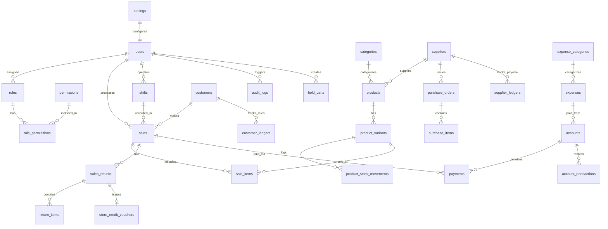

# Product Requirements Document (PRD)
## Enterprise Cloud-Based Point of Sale (POS) & Shop Management System

### 1. Product Overview
An enterprise-grade, cloud-based Point of Sale (POS) and Shop Management System designed to automate and streamline retail shop operations. The platform integrates real-time barcode checkout, inventory and product variant tracking, multi-tier pricing (Retail vs Wholesale), product-level tax handling (Inclusive vs Exclusive VAT), purchase order procurement, shift-based cash register reconciliation, expense management, double-entry financial accounting, and comprehensive reporting.

**Key Objectives:**
- **Centralized Operations:** Manage POS checkout, inventory, purchases, expenses, and accounts in a single web application.
- **Transactional Consistency:** Maintain real-time database transactions for inventory deduction, ledger balance updates, and sales recording.
- **Shift & Cash Drawer Integrity:** Ensure strict cash register auditing through daily shift opening floats, mid-day cash withdrawals, quick terminal PIN locking, and end-of-day Z-Report reconciliation.
- **Hardware Integration:** Support thermal receipt printers (58mm/80mm), barcode sticker label printers, cash drawer auto-kick triggers, and barcode scanners.
- **Role-Based Security:** Enforce granular backend permissions across Admin, Manager, and Cashier/Staff roles.
- **Scalability:** Built as a robust single-store solution with multi-branch database readiness.

---

### 2. Technology Stack
- **Frontend:** Next.js (App Router), React, TypeScript
- **UI & Styling:** Tailwind CSS, Lucide Icons
- **Backend:** Node.js / Next.js API Routes / Express.js Server
- **Database & ODM:** MongoDB Atlas (Multi-Node Replica Set), Mongoose ODM
- **Authentication:** HTTP-only JWT Sessions, bcrypt/Argon2 password hashing
- **Hardware & Document Formatting:** ESC/POS binary command utilities for thermal printing, Barcode sticker label rendering, PDF generation (pdfmake / puppeteer), ExcelJS for tabular exports
- **Offline Resiliency Buffer:** LocalStorage / IndexedDB queue for offline cart buffering and auto-sync upon network restoration

---

### 3. User Roles & Access Control Matrix

Backend middleware must strictly validate JWT session claims and role permissions before completing any state-changing action.

| Feature / Action | Admin | Manager | Cashier / Staff |
| :--- | :---: | :---: | :---: |
| POS Checkout & Receipts | ✅ | ✅ | ✅ |
| Hold & Resume Cart | ✅ | ✅ | ✅ |
| Terminal Quick Lock / Unlock | ✅ | ✅ | ✅ (Own PIN) |
| Customer Credit / Due Sales | ✅ | ✅ | ✅ (up to limit) |
| Redeem Store Credit Voucher | ✅ | ✅ | ✅ |
| Sales Returns & Refunds | ✅ | ✅ | ❌ (Requires Manager Override) |
| Shift Open / Close (Z-Report) | ✅ | ✅ | ✅ (Own shift only) |
| Product Catalog & Multi-Pricing | ✅ | ✅ | ❌ (View only) |
| Stock Adjustments & Wastage Write-Off | ✅ | ✅ | ❌ |
| Purchase Orders & Stock Receiving | ✅ | ✅ | ❌ |
| Expense Logging & Approval | ✅ | ✅ (Log & Approve) | ❌ (Log only) |
| View Product Cost Price & Profit | ✅ | ✅ | ❌ (Hidden from Cashier UI) |
| Apply Manual Discount $> 10\%$ | ✅ | ✅ (PIN required) | ❌ |
| Accounts & Bank Ledgers | ✅ | ❌ (View summary) | ❌ |
| Customer & Supplier Ledgers | ✅ | ✅ | ❌ (View only) |
| Barcode Label Printing | ✅ | ✅ | ❌ |
| Reports & Analytics | ✅ | ✅ (Operational) | ❌ |
| User & Role Management | ✅ | ❌ | ❌ |
| Audit Logs & System Settings | ✅ | ❌ | ❌ |

---

### 4. Required Pages & UI Requirements

#### 1. Login & Authentication
*   **Purpose:** Authenticate users securely.
*   **Access:** Public.
*   **UI Components:** Login form (Username/Email, Password, "Remember Me"), Auth spinner, Error alert.
*   **Business Rules:** Session stored in HTTP-only cookie; rate-limited to 5 failed attempts per minute.

#### 2. Dashboard
*   **Purpose:** Operational executive dashboard.
*   **Access:** Admin, Manager.
*   **UI Components:** Key Metric Cards (Today's Sales, Expenses, Net Profit, Active Shift Cash Float, Low Stock Count, Pending Dues), Sales trend chart, Top-selling products table, Real-time Low Stock & Expiry alert badges.

#### 3. POS Terminal (Point of Sale)
*   **Purpose:** Fast cashier checkout terminal optimized for keyboard & touchscreen use.
*   **Access:** All roles.
*   **UI Components:** Barcode scanner input field, Product grid with category filters, Price Tier Selector (Retail MRP vs Wholesale), Cart items table, Hold Cart bar, Customer Selector, Discount field, Split Payment modal, Store Credit Voucher field, Thermal Receipt preview modal.
*   **Key Actions & Hotkeys:**
    *   `F2`: Focus Barcode/Product Search
    *   `F4`: Hold / Resume Cart
    *   `F8`: Select/Create Customer
    *   `F9`: Open Payment Modal
    *   `Ctrl + L`: Quick Lock POS Terminal (Requires Cashier PIN to unlock)
    *   `ESC`: Clear Cart / Close Modals
*   **Payment Options:** Single or Split Payment (Cash + bKash/Nagad/Card + Store Credit Voucher + Customer Due Balance).

#### 4. Products & Multi-Tier Pricing
*   **Purpose:** Manage catalog, variant SKUs, multi-pricing, and tax configuration.
*   **Access:** Admin, Manager.
*   **UI Components:** Data table with filters, Create/Edit Product Modal, Variant Generator (Size, Color, Brand), Barcode Sticker Label Print modal.
*   **Fields:** Product Name, SKU/Barcode, Category, Unit (Pcs, Kg, Gram, Ltr, Ml, Box, Meter, Goj / Yard), Cost Price (Hidden from Cashier), Retail Selling Price (MRP), Wholesale Selling Price, Tax Type (INCLUSIVE vs EXCLUSIVE vs EXEMPT), Tax Rate %, Alert Quantity, Variants List (supports decimal selling quantities e.g. 2.5 Goj, 1.75 Meter).

#### 5. Barcode Label Generator [NEW]
*   **Purpose:** Generate and print physical barcode sticker labels for products/variants.
*   **Access:** Admin, Manager.
*   **UI Components:** Variant selector, Label quantity input, Sticker sheet layout selector (e.g. 38mm x 25mm 2-up roll), Thermal label print button.

#### 6. Categories & Brands
*   **Purpose:** Organize catalog taxonomy.
*   **Access:** Admin, Manager.
*   **Fields:** Category Name, Parent Category, Default Tax Rate, Description.

#### 7. Inventory & Stock Adjustments
*   **Purpose:** Real-time stock audit, FEFO tracking, and wastage write-offs.
*   **Access:** Admin, Manager.
*   **UI Components:** Stock list by variant, Low stock alerts, Expiry date tracking (FEFO), Manual Stock Adjustment & Wastage Write-off modal.
*   **Wastage Write-Off Rule:** Marking items as Damaged/Expired automatically posts a debit to `Expense Account: Inventory Shrinkage & Wastage` to ensure P&L accuracy.

#### 8. Purchase Orders (PO) & Stock Receiving
*   **Purpose:** Procurement workflow for buying goods from suppliers.
*   **Access:** Admin, Manager.
*   **UI Components:** PO Status table (Draft, Ordered, Partial, Received, Cancelled), Create PO form, Goods Received Note (GRN) modal.
*   **Actions:** Create PO, Receive Stock (supports partial shipments; automatically increases product inventory), Create Supplier Invoice & Accounts Payable entry.

#### 9. Sales History, Returns & Store Credit Vouchers
*   **Purpose:** Review past invoices, process returns, and issue/manage Store Credit Vouchers.
*   **Access:** Admin, Manager, Staff (View only).
*   **UI Components:** Invoice list, Date filter, Refund/Return Modal, Voucher Generator.
*   **Return Actions:** Select line items to return, specify reason, toggle Restock into Inventory vs Mark Damaged, issue Cash Refund or Store Credit Voucher.
*   **Proportional Refund Rule:** Items bought under discounts/promotions calculate net refund based on proportional net paid price.
*   **Store Credit Voucher Rule:** Generating a store credit refund produces a unique 12-character Voucher Code redeemable at checkout.

#### 10. Customers & Credit Ledger (Bakir Khata)
*   **Purpose:** Manage CRM data, credit limits, and customer dues.
*   **Access:** Admin, Manager, Staff (Create customer only).
*   **UI Components:** Customer directory, Customer Type (Retail vs Wholesale), Due balance list, Pay Due modal, Customer Transaction Ledger history.
*   **Business Rules:** Enforce max credit limit per customer; alert when due reaches 90% of limit.

#### 11. Suppliers & Payable Ledger
*   **Purpose:** Manage supplier vendor profiles and accounts payable.
*   **Access:** Admin, Manager.
*   **UI Components:** Supplier directory, Outstanding Payable table, Supplier Payment modal, Supplier Ledger history.

#### 12. Shift & Cash Register Management
*   **Purpose:** Audit daily cashier cash float and reconcile drawer balances.
*   **Access:** All Roles (Scoped to user shift).
*   **UI Components:** Open Shift modal (Enter Opening Cash Float), Mid-day Cash Out modal, Quick Terminal PIN Lock button, Close Shift & Z-Report modal (Expected Cash vs Actual Cash Counted, Overage/Shortage note).
*   **Approval Rule:** Absolute cash discrepancy $|discrepancy| > \$10$ requires Manager approval note.

#### 13. Expenses Management
*   **Purpose:** Log operational shop costs.
*   **Access:** Admin, Manager (Staff can submit pending expense logs).
*   **Fields:** Date, Amount, Expense Category, Payment Account, Receipt Voucher Number, Notes.
*   **Business Rules:** Deducts funds from selected Cash/Bank account upon approval. Warns if account balance is insufficient.

#### 14. Accounts / Cash & Bank
*   **Purpose:** Financial accounts management.
*   **Access:** Admin.
*   **Fields:** Account Name (e.g., Main Cash Drawer, City Bank, bKash Merchant), Account Type, Current Balance.
*   **Actions:** Add account, Fund Transfer between accounts (Debit source, Credit target in 1 transaction).

#### 15. Financial Account Ledger
*   **Purpose:** Double-entry immutable transaction log.
*   **Access:** Admin.
*   **UI Components:** Full Debit/Credit ledger table, account filter, date range picker.

#### 16. Reports Engine & Materialized Summaries
*   **Purpose:** Business intelligence reporting.
*   **Access:** Admin, Manager.
*   **Supported Exports:** On-screen Preview, Print (A4 & Thermal), PDF Download, Excel Export.
*   **Report Types:** Daily Closing Z-Report, Sales Report (by item, cashier, category, retail vs wholesale), Inventory Valuation Report, Inventory Wastage Report, Purchase Summary, Customer Due Aging, Supplier Payable Report, Profit & Loss Report.

#### 17. User & Role Management
*   **Purpose:** System user accounts, cashier PINs, and RBAC privileges.
*   **Access:** Admin.
*   **Fields:** Name, Email/Username, Cashier PIN (4-digit), Password Reset, Assigned Role, Account Status.

#### 18. Audit Logs
*   **Purpose:** Append-only system security audit trail.
*   **Access:** Admin.
*   **Fields:** Timestamp, User ID, Action (CREATE, UPDATE, DELETE, LOGIN, OFFLINE_OVERSELL), Entity Name, Entity ID, IP Address, Metadata Diff.

#### 19. Settings & Hardware Configuration
*   **Purpose:** Global shop and hardware setup.
*   **Access:** Admin.
*   **Fields:** Shop Name, Address, Phone, Default Tax/VAT Rate %, Currency Symbol, Thermal Printer Type (58mm/80mm), Barcode Sticker Paper Format, ESC/POS Cash Drawer Trigger Code, Receipt Header/Footer text, Allow Negative Stock Toggle (Yes/No).

---

### 5. Database Design & Mermaid ERD

#### Mermaid Entity-Relationship Diagram

---

### 6. Core Business Logic & Workflows

#### 6.1 Multi-Pricing & Tax Calculation Rules
- **Pricing Tier:** If Customer is marked `WHOLESALE`, POS automatically loads `WholesaleSellingPrice`; otherwise defaults to `RetailSellingPrice (MRP)`.
- **Tax Calculation:**
  - `TAX_INCLUSIVE`: $\text{Tax Amount} = \text{Selling Price} - \left(\frac{\text{Selling Price}}{1 + \text{Tax Rate \%}}\right)$
  - `TAX_EXCLUSIVE`: $\text{Tax Amount} = \text{Selling Price} \times \text{Tax Rate \%}$

#### 6.2 Inventory Wastage & Loss Accounting
When stock is marked as Damaged/Expired:
1. Deduct variant quantity from inventory.
2. Log `product_stock_movements` (Type: ADJUSTMENT, Reason: WASTAGE).
3. Automatically create an `expense` entry linked to `Expense Category: Inventory Shrinkage & Loss`.
4. Create an `account_transaction` (DEBIT) to record the loss in the financial ledger.

#### 6.3 Store Credit Voucher Issuance & Redemption
- Issuing refund as Store Credit generates a unique `voucher_code` (e.g. `CR-9821-X47A`) with initial balance equal to refund price.
- Redeeming voucher at POS reduces voucher balance; if cart total exceeds voucher balance, remaining amount is paid via Cash/MFS.

#### 6.4 Shift Terminal Quick Lock
Cashier presses `Ctrl + L` or clicks "Lock Terminal". POS enters PIN Lock Screen. Active shift remains OPEN, active cart state is preserved, but all checkout and system actions are blocked until Cashier enters their 4-digit PIN or Admin logs in.

#### 6.5 Offline Sync Negative Stock Conflict Policy
If offline queued sales exceed online inventory upon reconnection:
1. Process sale successfully to honor customer receipt.
2. Set `product_variants.CurrentStock` to negative.
3. Log an `OFFLINE_OVERSELL_WARNING` entry in `audit_logs`.
4. Trigger Dashboard notification for Manager to perform stock count adjustment.

---

### 7. Non-Functional Requirements (NFRs)

#### 7.1 Performance SLAs
- **Barcode Scan to Cart Addition:** $< 100\text{ ms}$ UI update time.
- **POS Transaction Checkout Commit:** $< 1.5\text{ seconds}$ end-to-end API response time.
- **Report Generation (10,000 records):** $< 3.0\text{ seconds}$ preview load time using pre-aggregated materialized summary tables.
- **Page Load Speed:** First Contentful Paint (FCP) $< 1.2\text{s}$, Largest Contentful Paint (LCP) $< 2.0\text{s}$.

#### 7.2 Hardware Integration Specs
- **Thermal Receipt Printers:** Compatibility for **58mm** and **80mm** thermal receipt printers using ESC/POS binary command streams.
- **Barcode Label Printers:** Render sticker sheets (e.g. 38mm x 25mm 2-up rolls) via HTML5 Canvas or raw ESC/POS / ZPL printer commands.
- **Cash Drawer Kick:** Send ESC/POS cash drawer pulse commands (`\x1B\x70\x00\x19\xFA`) upon checkout.

#### 7.3 Usability & POS Keyboard Hotkeys
- `F2`: Jump to Barcode / Product Search Box
- `F4`: Park / Hold Current Cart
- `Shift + F4`: Resume Parked Cart List
- `F8`: Focus Customer Selector
- `F9`: Trigger Checkout / Open Payment Modal
- `Ctrl + L`: Quick Lock Terminal Screen
- `Enter`: Confirm Payment & Print Invoice
- `ESC`: Close active modal / Clear cart focus

---

### 8. Operational Flows, Edge Cases & Exception Handling

#### 8.1 Missing Operational Flows
1. **Hold Cart Auto-Expiry:** Held carts do not reserve stock and auto-expire after 24 hours or shift closing.
2. **Partial PO Receiving:** Supports receiving partial shipments; sets status to `PARTIALLY_RECEIVED` and logs proportional supplier due.
3. **Shift Shortage/Overage Approval:** Shortage/Overage $> \$10$ requires Manager signoff note before shift can close.

#### 8.2 Edge Cases & Security
1. **Concurrent Last-Item Scanning:** MongoDB Client Sessions with document-level ACID locks (`session.withTransaction()`) prevent double selling.
2. **Proportional Discount Refund:** Refunds for items bought under invoice-level discounts calculate refund based on net paid price per line item.
3. **Cost Price Privacy:** Cost prices and profit margins are omitted from Cashier role API payloads and UI.
4. **Manager PIN for Discounts:** Manual discounts between 11%–50% require Manager PIN; $> 50\%$ requires Admin password.
5. **Idempotency Keys:** POS checkout requests send client-generated UUID `Idempotency-Key` to prevent duplicate billing on network retry.

---

### 9. Development Phases & Roadmap

- **Phase 1 (Core Foundation & RBAC):** Database schema setup, Auth & JWT sessions, RBAC permissions, Shell layout.
- **Phase 2 (Catalog, Multi-Pricing & Procurement):** Products, Categories, Multi-Pricing (Retail vs Wholesale), Tax setup, Barcode Label generator, Suppliers, Purchase Orders (PO) workflow.
- **Phase 3 (POS Terminal, Hardware & Cash Management):** POS checkout interface, Barcode scanner integration, Hold/Resume cart, Quick Terminal PIN Lock, Multi-Payment split modal, Store Credit Vouchers, Thermal printer & Cash drawer integration, Shift Open/Close & Z-Report.
- **Phase 4 (Finance, Dues, Returns & Wastage):** Customer Due Ledger (Bakir Khata), Supplier Payable Ledger, Expense logging, Inventory Wastage Accounting, Accounts & Double-entry Ledger, Sales Returns.
- **Phase 5 (Reporting & Analytics):** Materialized summary tables, Reports engine (Sales, Stock Valuation, Customer Dues, Z-Report, P&L), PDF generation, Excel exports, Print previews.
- **Phase 6 (Hardening & Cloud Launch):** Performance tuning, security audit, stress testing, backup setup, Cloud deployment.

---
*Note: This document represents the complete, revised Product Requirements Specification for the Cloud-Based POS & Shop Management System.*
