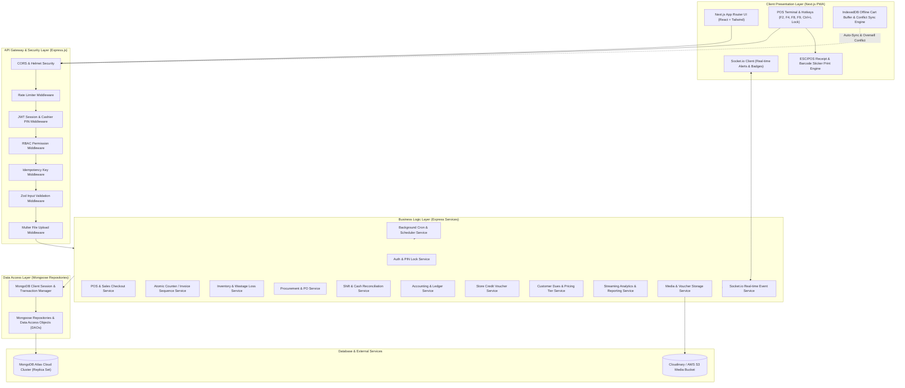

# System Architecture Document (SAD)
## Enterprise Cloud-Based Point of Sale (POS) & Shop Management System

**Architecture Pattern:** 3-Tier Layered Monolithic Architecture  
**Frontend:** Next.js (App Router, React, TypeScript, Tailwind CSS, TanStack Query, IndexedDB)  
**Backend:** Express.js (Node.js REST API + WebSocket, Layered Architecture: Controllers, Services, Repositories)  
**Database:** MongoDB Atlas (Cloud Multi-Node Cluster, Mongoose ODM, ACID Multi-Document Transactions)  
**Target Specification:** [`PRD.md`](file:///c:/Users/lenovo/Documents/point%20of%20sale%20webbase/PRD.md)  
**Author:** Senior Systems Architect & Lead Software Engineer  
**Date:** September 7, 2026  

---

## 1. High-Level System Architecture Diagram



---

## 2. Layered Architecture Directory Breakdown

```
├── client/ (Next.js Application)
│   ├── src/app/ (Pages & App Router Layouts)
│   ├── src/components/ (POS, Barcode Generator, Inventory, Reports UI Components)
│   ├── src/lib/ (IndexedDB, ESC/POS Print Helper, Barcode Sticker Renderer, API Client, Socket Client)
│   └── src/hooks/ (React Custom Hooks, Hotkey Handlers, Real-time Listeners)
│
└── server/ (Express.js Backend Application)
    ├── src/config/ (MongoDB Atlas Connection, Cloudinary/S3, Environment Variables)
    ├── src/middlewares/ (Auth, CashierPIN, RBAC, RateLimit, Idempotency, Validation, Multer)
    ├── src/controllers/ (HTTP Request Handling & Response Formatting)
    ├── src/services/ (Pure Business Logic & Transaction Workflows)
    ├── src/jobs/ (Node-Cron Schedulers: Nightly Summary, Expired Cart Cleanup, FEFO Alert)
    ├── src/sockets/ (Socket.io Event Handlers for Real-time Alerts)
    ├── src/repositories/ (Mongoose Data Access Layer)
    ├── src/models/ (Mongoose Schemas & TypeScript Interfaces)
    └── src/utils/ (Logger, ESC/POS Formatter, Streaming Excel/PDF Builders)
```

---

## 3. MongoDB Data Models & Indexing Strategy

### 3.1 Counters Collection (Atomic Sequential Invoicing) [NEW]
- **`counters` Collection:**
  ```typescript
  {
    _id: String, // e.g. "invoice_seq_20260907"
    seq: Number
  }
  ```

### 3.2 Product & Multi-Tier Pricing Schema
- **`products` Collection:**
  ```typescript
  {
    _id: ObjectId,
    name: String,
    categoryId: ObjectId (Ref: Category),
    supplierId: ObjectId (Ref: Supplier), // Default supplier for reordering
    unit: String ("Pcs", "Kg", "Gram", "Ltr", "Ml", "Box", "Meter", "Goj"),
    imageUrl: String,
    baseCostPrice: Number, // Hidden from Cashier UI
    baseSellingPrice: Number,
    taxType: String ("INCLUSIVE", "EXCLUSIVE", "EXEMPT"),
    taxRate: Number, // Percentage (e.g. 15 for 15% VAT)
    variants: [
      {
        _id: ObjectId,
        sku: String,
        barcode: String,
        attributeName: String,
        costPrice: Number,
        retailSellingPrice: Number,
        wholesaleSellingPrice: Number,
        currentStock: Number,
        alertQty: Number,
        expiryDate: Date
      }
    ],
    createdAt: Date,
    updatedAt: Date
  }
  ```

### 3.3 Store Credit Voucher Schema
- **`store_credit_vouchers` Collection:**
  ```typescript
  {
    _id: ObjectId,
    voucherCode: String (Unique Index: CR-XXXX-XXXX),
    customerId: ObjectId (Ref: Customer),
    initialBalance: Number,
    currentBalance: Number,
    issuedBy: ObjectId (Ref: User),
    status: String ("ACTIVE", "EXHAUSTED", "EXPIRED"),
    expiresAt: Date,
    createdAt: Date
  }
  ```

### 3.4 Inventory Wastage & Stock Movement Schema
- **`stock_movements` Collection:**
  ```typescript
  {
    _id: ObjectId,
    productId: ObjectId,
    variantId: ObjectId,
    type: String ("IN", "OUT", "ADJUSTMENT", "RETURN", "WASTAGE"),
    quantity: Number,
    referenceType: String ("SALE", "PO", "MANUAL", "RETURN", "WASTAGE_EXPENSE"),
    referenceId: ObjectId,
    reason: String,
    userId: ObjectId (Ref: User),
    createdAt: Date
  }
  ```

### 3.5 Materialized Daily Sales Summary Schema
- **`daily_sales_summaries` Collection:**
  ```typescript
  {
    _id: ObjectId,
    date: String (Unique Index: YYYY-MM-DD),
    totalSalesRevenue: Number,
    totalCOGS: Number,
    totalExpenses: Number,
    totalWastageLoss: Number,
    netProfit: Number,
    totalInvoices: Number,
    updatedAt: Date
  }
  ```

### 3.6 Complete Database Indexing & TTL Policy
```typescript
// Compound & Unique Indexes
ProductSchema.index({ "variants.barcode": 1 }, { unique: true, sparse: true });
ProductSchema.index({ "variants.sku": 1 }, { unique: true });
ProductSchema.index({ name: "text", "variants.attributeName": "text" }); // Full-text search
SaleSchema.index({ invoiceNo: 1 }, { unique: true });
SaleSchema.index({ shiftId: 1, createdAt: -1 });
SaleSchema.index({ customerId: 1, createdAt: -1 });
StockMovementSchema.index({ variantId: 1, createdAt: -1 });
AccountTransactionSchema.index({ accountId: 1, createdAt: -1 });
AuditLogSchema.index({ createdAt: -1, entity: 1 });

// TTL Index for Temporary Token Blacklist (Expires after 24h)
TokenBlacklistSchema.index({ createdAt: 1 }, { expireAfterSeconds: 86400 });
```

---

## 4. Atomic Sequential Invoice Generator Service

To prevent race conditions and duplicate invoice numbers during simultaneous cashier checkouts in MongoDB Atlas:

```typescript
// SequenceService.ts
import mongoose from 'mongoose';
import Counter from '../models/Counter';

export async function generateSequentialInvoiceNo(session: mongoose.ClientSession): Promise<string> {
  const today = new Date().toISOString().slice(0, 10).replace(/-/g, ''); // YYYYMMDD
  const counterKey = `invoice_seq_${today}`;

  const counter = await Counter.findOneAndUpdate(
    { _id: counterKey },
    { $inc: { seq: 1 } },
    { new: true, upsert: true, session }
  );

  const paddedSeq = String(counter.seq).padStart(5, '0');
  return `INV-${today}-${paddedSeq}`; // e.g., INV-20260907-00001
}
```

---

## 5. Real-Time Notification & WebSocket Architecture (Socket.io)

```
+-------------------------------------------------------------+
|                      Next.js Frontend                       |
|  +-------------------------------------------------------+  |
|  | Socket.io Client Hook: useRealTimeNotifications()     |  |
|  | - Listens for 'LOW_STOCK_ALERT'                       |  |
|  | - Listens for 'SHIFT_DISCREPANCY_ALERT'               |  |
|  | - Listens for 'OFFLINE_OVERSELL_ALERT'                |  |
|  +--------------------------+----------------------------+  |
+-----------------------------|-------------------------------+
                              | (WebSocket Bi-directional Stream)
                              v
+-------------------------------------------------------------+
|                    Express.js Backend API                   |
|  +-------------------------------------------------------+  |
|  | Socket.io Gateway Server (Authenticated via JWT)      |  |
|  | - Emits real-time alerts to Admin & Manager rooms     |  |
|  | - Triggers instant UI badge counters in POS Header    |  |
|  +-------------------------------------------------------+  |
+-------------------------------------------------------------+
```

---

## 6. Background Jobs & Scheduler Architecture (Node-Cron)

Background schedulers running inside Express.js (`src/jobs/scheduler.ts`):

```typescript
import cron from 'node-cron';
import { processNightlyMaterializedSummary } from '../services/ReportService';
import { cleanupExpiredHoldCarts } from '../services/PosService';
import { scanFefoExpiryAlerts } from '../services/InventoryService';

export function initBackgroundSchedulers() {
  // 1. Nightly Materialized Summary (Every midnight at 00:05 AM)
  cron.schedule('5 0 * * *', async () => {
    await processNightlyMaterializedSummary();
  });

  // 2. Expired Hold-Cart Cleanup (Runs every hour)
  cron.schedule('0 * * * *', async () => {
    await cleanupExpiredHoldCarts();
  });

  // 3. Scan 30-Day FEFO Expiry Alerts (Every morning at 07:00 AM)
  cron.schedule('0 7 * * *', async () => {
    await scanFefoExpiryAlerts();
  });
}
```

---

## 7. Media & File Upload Storage Architecture

- **Engine:** Multer memory storage + Cloudinary / AWS S3 SDK.
- **Components:**
  - `POST /api/v1/uploads/image` - Upload Product Images / Shop Logo.
  - `POST /api/v1/uploads/voucher` - Upload Expense Receipts / Supplier Invoice scans.
- **Security:** Strict file MIME-type filtering (`image/jpeg`, `image/png`, `image/webp`, `application/pdf`) and 5MB size limit.

---

## 8. Memory-Efficient Streaming Export Engine (PDF & Excel)

To prevent Node.js Heap Out-Of-Memory crashes when exporting large reports (50,000+ records):

```typescript
// StreamingExcelService.ts
import { Response } from 'express';
import ExcelJS from 'exceljs';
import Sale from '../models/Sale';

export async function streamSalesReportExcel(res: Response, queryFilters: any) {
  res.setHeader('Content-Type', 'application/vnd.openxmlformats-officedocument.spreadsheetml.sheet');
  res.setHeader('Content-Disposition', 'attachment; filename=sales_report.xlsx');

  const workbook = new ExcelJS.stream.xlsx.WorkbookWriter({ stream: res });
  const worksheet = workbook.addWorksheet('Sales Report');

  worksheet.columns = [
    { header: 'Invoice No', key: 'invoiceNo', width: 22 },
    { header: 'Date', key: 'createdAt', width: 18 },
    { header: 'Total Amount', key: 'totalAmount', width: 15 },
    { header: 'Paid Amount', key: 'paidAmount', width: 15 },
    { header: 'Status', key: 'paymentStatus', width: 12 }
  ];

  // Stream directly from MongoDB cursor without loading all documents into RAM
  const cursor = Sale.find(queryFilters).cursor();
  for await (const doc of cursor) {
    worksheet.addRow({
      invoiceNo: doc.invoiceNo,
      createdAt: doc.createdAt.toISOString().slice(0, 10),
      totalAmount: doc.totalAmount,
      paidAmount: doc.paidAmount,
      paymentStatus: doc.paymentStatus
    }).commit();
  }

  await worksheet.commit();
  await workbook.commit();
}
```

---

## 9. Production Deployment & Infrastructure Topology

```
+-------------------------------------------------------------+
|               Internet / Client HTTPS Requests              |
+-----------------------------+-------------------------------+
                              |
                              v
+-------------------------------------------------------------+
|            Nginx Reverse Proxy & SSL Termination            |
|  - Routes /api/* & /socket.io/*  ---> Express API (Port 5000)|
|  - Routes /*                     ---> Next.js PWA (Port 3000)|
+-----------------------------+-------------------------------+
                              |
                              v
+-------------------------------------------------------------+
|          Production Server (Docker / PM2 Cluster)           |
|  +---------------------------+ +--------------------------+ |
|  | Next.js App (SSR/PWA)     | | Express API (Cluster x4) | |
|  +---------------------------+ +--------------------------+ |
+---------------------------------------------+---------------+
                                              |
                                              v
+-------------------------------------------------------------+
|              MongoDB Atlas Cloud (Replica Set)              |
+-------------------------------------------------------------+
```

---

## 10. Complete RESTful API Matrix (Express.js)

### Auth & Terminal Lock Routes (`/api/v1/auth`)
- `POST /api/v1/auth/login` - Authenticate & issue HTTP-only JWT
- `POST /api/v1/auth/verify-pin` - Quick Terminal unlock via Cashier 4-digit PIN
- `POST /api/v1/auth/logout` - Clear session cookie

### POS & Checkout Routes (`/api/v1/pos`)
- `GET  /api/v1/pos/products/search?q={query}&pricingTier={RETAIL|WHOLESALE}` - Fast lookup (< 100ms)
- `POST /api/v1/pos/checkout` - Atomic checkout (Requires `Idempotency-Key`)
- `POST /api/v1/pos/hold-cart` - Park active cart to backend (24h TTL)
- `GET  /api/v1/pos/held-carts` - Retrieve active held carts list for cashier
- `DELETE /api/v1/pos/held-carts/:id` - Discard a parked cart
- `GET  /api/v1/pos/vouchers/verify?code={code}` - Verify Store Credit Voucher balance
- `POST /api/v1/pos/sync-offline-queue` - Process queued offline sales with conflict resolution

### Product & Barcode Sticker Routes (`/api/v1/products`)
- `GET  /api/v1/products` - List products & variants (role-filtered: cost hidden from Cashier)
- `POST /api/v1/products` - Create product & multi-tier pricing
- `PUT  /api/v1/products/:id` - Update product details
- `DELETE /api/v1/products/:id` - Soft-delete product (sets isActive: false)
- `GET  /api/v1/products/barcode-labels` - Generate printable barcode sticker sheet payload

### Categories Routes (`/api/v1/categories`) [ADDED]
- `GET  /api/v1/categories` - List all categories & subcategories
- `POST /api/v1/categories` - Create category with optional defaultTaxRate
- `PUT  /api/v1/categories/:id` - Update category name, parent, or default tax rate
- `DELETE /api/v1/categories/:id` - Soft-delete category

### Brands Routes (`/api/v1/brands`) [ADDED]
- `GET  /api/v1/brands` - List all brands
- `POST /api/v1/brands` - Create brand
- `PUT  /api/v1/brands/:id` - Update brand
- `DELETE /api/v1/brands/:id` - Soft-delete brand

### Inventory & Wastage Routes (`/api/v1/inventory`)
- `POST /api/v1/inventory/adjust` - Stock adjustment & Wastage Write-Off
- `GET  /api/v1/inventory/alerts` - Get low stock & expiry warnings

### Procurement Routes (`/api/v1/procurement`)
- `GET  /api/v1/procurement/pos` - List purchase orders
- `POST /api/v1/procurement/pos` - Create purchase order
- `PUT  /api/v1/procurement/pos/:id` - Update PO (e.g. mark as ORDERED)
- `POST /api/v1/procurement/pos/:id/receive` - Goods Received Note (GRN) receiving

### Shift & Cash Register Routes (`/api/v1/shifts`)
- `GET  /api/v1/shifts/active` - Get active shift status for cashier
- `POST /api/v1/shifts/open` - Open shift & record cash float
- `POST /api/v1/shifts/cash-out` - Record mid-day cash withdrawal
- `POST /api/v1/shifts/close` - Reconcile cash & generate Z-Report

### Sales & Returns Routes (`/api/v1/sales`)
- `GET  /api/v1/sales` - List invoices with filters
- `GET  /api/v1/sales/:id` - Get invoice details
- `POST /api/v1/sales/:id/return` - Process partial/full return & refund

### Customers & Dues Routes (`/api/v1/customers`)
- `GET  /api/v1/customers` - Directory & due balance list
- `POST /api/v1/customers` - Create customer
- `PUT  /api/v1/customers/:id` - Update customer profile & credit limit
- `POST /api/v1/customers/:id/pay-due` - Record customer due collection
- `GET  /api/v1/customers/:id/ledger` - View customer transaction ledger

### Suppliers & Payables Routes (`/api/v1/suppliers`)
- `GET  /api/v1/suppliers` - List vendors & payable balances
- `POST /api/v1/suppliers` - Create supplier
- `PUT  /api/v1/suppliers/:id` - Update supplier profile
- `POST /api/v1/suppliers/:id/pay-due` - Record supplier payment
- `GET  /api/v1/suppliers/:id/ledger` - View supplier transaction ledger

### Expenses & Financial Accounts Routes (`/api/v1/expenses`, `/api/v1/accounts`)
- `GET  /api/v1/expenses` - List shop expenses
- `POST /api/v1/expenses` - Create expense & trigger account debit
- `GET  /api/v1/accounts` - List cash/bank accounts & balances
- `POST /api/v1/accounts` - Create new account (Cash/Bank/MFS)
- `POST /api/v1/accounts/transfer` - Inter-account fund transfer

### Reports & Analytics Routes (`/api/v1/reports`)
- `GET  /api/v1/reports/z-report?shiftId={id}` - Shift closing Z-Report
- `GET  /api/v1/reports/sales/stream?format=excel|pdf` - Memory-safe streaming report export
- `GET  /api/v1/reports/profit-loss` - Profit & Loss statement
- `GET  /api/v1/reports/inventory-valuation` - Stock valuation report
- `GET  /api/v1/reports/customer-dues` - Customer due aging report
- `GET  /api/v1/reports/supplier-payables` - Supplier payable report

### User & RBAC Management Routes (`/api/v1/users`) [ADDED]
- `GET  /api/v1/users` - List all staff accounts (Admin only)
- `POST /api/v1/users` - Create new user account with role assignment
- `PUT  /api/v1/users/:id` - Update user profile, role, or reset password
- `PATCH /api/v1/users/:id/status` - Activate or deactivate user account
- `PATCH /api/v1/users/:id/pin` - Update cashier 4-digit PIN

### System Settings Routes (`/api/v1/settings`) [ADDED]
- `GET  /api/v1/settings` - Retrieve current shop & hardware settings
- `PUT  /api/v1/settings` - Update shop name, tax defaults, printer config, receipt text

### Audit Logs Routes (`/api/v1/audit-logs`) [ADDED]
- `GET  /api/v1/audit-logs` - Paginated audit trail with filters (entity, action, userId, date range)

### Uploads Routes (`/api/v1/uploads`)
- `POST /api/v1/uploads/image` - Upload product/logo image
- `POST /api/v1/uploads/voucher` - Upload expense voucher scan

---

## 11. Final Architectural Readiness Matrix

| Architectural Dimension | Component / Solution | Status |
| :--- | :--- | :---: |
| **Layered Monolith Structure** | 3-Tier Layered Architecture (Next.js + Express + MongoDB Atlas) | ✅ Production Ready |
| **Atomic Invoicing Sequence** | `counters` collection with `findOneAndUpdate` & `$inc` | ✅ Production Ready |
| **Real-time Notifications** | Socket.io Server + JWT Auth Room Management | ✅ Production Ready |
| **Background Cron Schedulers** | Node-Cron for Nightly Summaries, Hold-cart cleanup, FEFO scan | ✅ Production Ready |
| **Media & Voucher Storage** | Multer + Cloudinary / AWS S3 Storage Adapter | ✅ Production Ready |
| **Streaming Report Engine** | ExcelJS Streaming WorkbookWriter & Cursor Streaming | ✅ Production Ready |
| **DB Indexing & TTL Policy** | Compound Unique Indexes on Barcodes/SKUs + TTL Tokens | ✅ Production Ready |
| **Production Deployment** | Nginx Reverse Proxy + Docker / PM2 Cluster Topology | ✅ Production Ready |

---
*This document defines the complete, production-grade System Architecture for the Cloud-Based POS & Shop Management System.*
