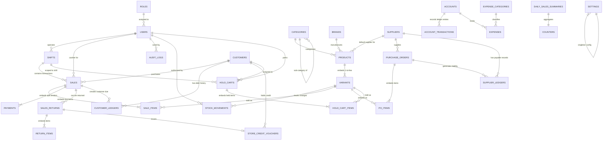

# Database Architecture & Design Specification
## Enterprise Cloud-Based Point of Sale (POS) & Shop Management System

**Database Engine:** MongoDB Atlas (Multi-Node Replica Set, Mongoose ODM, MongoDB Server v6.0+)  
**Consistency Model:** Strong Consistency with Multi-Document ACID Transactions (`readConcern: 'majority'`, `writeConcern: 'majority'`)  
**Reference Documents:** [`dfd.md`](file:///c:/Users/lenovo/Documents/point%20of%20sale%20webbase/dfd.md), [`architecture.md`](file:///c:/Users/lenovo/Documents/point%20of%20sale%20webbase/architecture.md), and [`PRD.md`](file:///c:/Users/lenovo/Documents/point%20of%20sale%20webbase/PRD.md)  
**Author:** Lead Database Architect & Senior Backend Engineer  
**Date:** September 7, 2026  

---

## 1. Collection List

The database is organized into 9 logical domains across **25 physical MongoDB collections**, optimized for high-throughput retail checkout, strict auditing, and sub-100ms analytics queries.

| # | Collection Name | Domain | Primary Function | Growth Rate | Sharding / Partition Key |
| :---: | :--- | :--- | :--- | :---: | :--- |
| 1 | `counters` | System & Sequence | Atomic monotonic sequence generator for invoices & orders | Negligible | Single document per sequence key |
| 2 | `roles` | Auth & Security | RBAC permissions matrix and role definitions | Static | N/A (Cached in RAM) |
| 3 | `users` | Auth & Staff | User credentials, Cashier 4-digit PIN hash, profile data | Low | `_id` |
| 4 | `token_blacklist` | Auth & Security | JWT token revocation with automated TTL expiration | Low (Rolling) | `expiresAt` (TTL Index) |
| 5 | `categories` | Inventory Catalog | Product taxonomy hierarchy (Parent/Child support, default VAT) | Low | `_id` |
| 6 | `brands` | Inventory Catalog | Manufacturers, brands, and vendor classifications | Low | `_id` |
| 7 | `products` | Inventory Catalog | Product master data, units, supplier ref, tax profile, embedded variants | Moderate | `categoryId` |
| 8 | `stock_movements` | Inventory & Audit | Immutable ledger of all inventory IN, OUT, ADJUST, WASTAGE | Very High | `variantId`, `createdAt` |
| 9 | `purchase_orders` | Procurement | Vendor orders, shipments, and Goods Received Notes (GRN) | Moderate | `supplierId`, `createdAt` |
| 10 | `sales` | Sales & Checkout | Invoices, item snapshots, split payments, checkout state | Very High | `createdAt` (Range Sharding) |
| 11 | `store_credit_vouchers` | Returns & Loyalty | Redeemable customer credit balances from returns | Moderate | `customerId`, `voucherCode` |
| 12 | `daily_sales_summaries` | Analytics | Materialized nightly sales, COGS, expenses, and net profit | Low (1/day) | `date` (Unique Index) |
| 13 | `sales_returns` | Sales & Returns | Return receipts, condition classification, refund records | Moderate | `saleId`, `createdAt` |
| 14 | `shifts` | Shift & Cash Mgmt | Cashier terminal shifts, drawer float, blind counts, Z-reports | Moderate | `userId`, `openedAt` |
| 15 | `customers` | CRM & Receivables | Customer registry, credit limits, outstanding debts | High | `phone` |
| 16 | `customer_ledgers` | Financial Accounting | Immutable debit/credit ledger of customer dues & collections | High | `customerId`, `createdAt` |
| 17 | `suppliers` | Procurement & CRM | Vendor contacts, payables, delivery terms | Low | `_id` |
| 18 | `supplier_ledgers` | Financial Accounting | Immutable debit/credit ledger of vendor payables & payouts | Moderate | `supplierId`, `createdAt` |
| 19 | `expense_categories` | Accounting | Classifications for operational shop expenses | Static | `_id` |
| 20 | `accounts` | Financial Accounting | Chart of financial accounts (Cash, Bank, MFS wallets) | Low | `accountType` |
| 21 | `account_transactions` | Financial Accounting | Double-entry journal transactions for all cash movements | Very High | `accountId`, `createdAt` |
| 22 | `expenses` | Accounting | Shop expenses with physical voucher receipt media URLs | Moderate | `accountId`, `createdAt` |
| 23 | `audit_logs` | Compliance & Security | Tamper-evident, immutable system audit trail | Extreme | `createdAt`, `entity` |
| 24 | `hold_carts` | Sales & Checkout | Parked cart sessions with automated 24h TTL expiration | Moderate | `cartId`, `expiresAt` (TTL Index) |
| 25 | `settings` | System & Config | Global shop profile, hardware config, tax & negative stock toggle | Static | `isDefault` |

---

## 2. Detailed Schema Definitions

All 25 physical MongoDB collection schema definitions (TypeScript interfaces, field data types, constraints, and validation rules) have been organized and moved to [`database-schema.md`](file:///c:/Users/lenovo/Documents/point%20of%20sale%20webbase/database-schema.md).

---

## 3. Relationships & Schema Design Strategy

MongoDB is a document-oriented database. To achieve sub-100ms response times at high volume while preserving absolute financial audit integrity, we implement a hybrid **Embedding vs Referencing** architecture:

```
+-------------------------------------------------------------------------------+
|                       SCHEMA DESIGN DECISION MATRIX                           |
+------------------------------+--------------------+---------------------------+
| Pattern                      | Applied Entities   | Engineering Justification |
+------------------------------+--------------------+---------------------------+
| 1-to-Few (Embedded)          | Products.variants  | Variants (size/flavor) are|
|                              | Sales.items        | always retrieved with     |
|                              | PO.items           | parent doc; eliminates    |
|                              | Sales.payments     | expensive $lookups.       |
+------------------------------+--------------------+---------------------------+
| 1-to-Many / 1-to-Squillions  | Stock Movements    | Unbounded growth requires |
| (Referenced)                 | Ledgers (Customer/ | independent collections to|
|                              | Supplier/Account)  | prevent exceeding MongoDB |
|                              | Audit Logs         | 16MB document size limit. |
+------------------------------+--------------------+---------------------------+
| Historical Snapshot Pattern  | SaleItems snapshots| If product price or tax   |
|                              | (unitCostPrice,    | changes later, past sale  |
|                              | unitSellingPrice)  | records must retain exact |
|                              |                    | historical values.        |
+------------------------------+--------------------+---------------------------+
```

---

## 4. Entity-Relationship Diagram (ERD)

The following Mermaid ERD maps all **25 database collections**, foreign key references, cardinality (`||--o{`, `||--||`), and key embedded structures.



---

## 5. Comprehensive Indexing & TTL Strategy

Indexes are tailored to eliminate in-memory sorting, support compound analytical queries, enforce uniqueness, and auto-purge temporary tokens.

```typescript
// ============================================================================
// 1. COUNTERS & AUTH
// ============================================================================
// Counters: Unique Sequence ID
db.counters.createIndex({ _id: 1 }, { unique: true });

// Roles: Unique Role Name
db.roles.createIndex({ name: 1 }, { unique: true });

// Users: Unique username & phone
db.users.createIndex({ username: 1 }, { unique: true });
db.users.createIndex({ phone: 1 }, { unique: true, sparse: true });
db.users.createIndex({ roleId: 1 });

// Token Blacklist: Automated TTL purge after 24 hours (86,400 seconds)
db.token_blacklist.createIndex({ expiresAt: 1 }, { expireAfterSeconds: 0 });
db.token_blacklist.createIndex({ tokenHash: 1 }, { unique: true });

// ============================================================================
// 2. PRODUCTS & INVENTORY CATALOG
// ============================================================================
// Categories: Unique code & subcategory hierarchy lookup
db.categories.createIndex({ code: 1 }, { unique: true });
db.categories.createIndex({ parentId: 1 });

// Brands: Fast name lookup
db.brands.createIndex({ name: 1 });

// Products: Unique constraints on SKU and Barcode (Sparse to permit null on unbarcoded bulk goods)
db.products.createIndex({ "variants.sku": 1 }, { unique: true });
db.products.createIndex({ "variants.barcode": 1 }, { unique: true, sparse: true });

// Full-text search for instant POS item typing
db.products.createIndex(
  { name: "text", "variants.attributeName": "text" },
  { weights: { name: 10, "variants.attributeName": 5 }, name: "product_text_search" }
);

// Filter indexes
db.products.createIndex({ categoryId: 1, isActive: 1 });
db.products.createIndex({ supplierId: 1 });
db.products.createIndex({ "variants.currentStock": 1 });
db.products.createIndex({ "variants.expiryDate": 1 }); // FEFO Expiry indexing

// Stock Movements: Chronological tracking per variant
db.stock_movements.createIndex({ variantId: 1, createdAt: -1 });
db.stock_movements.createIndex({ referenceType: 1, referenceId: 1 });

// ============================================================================
// 3. PROCUREMENT (PURCHASE ORDERS)
// ============================================================================
// Purchase Orders: Unique PO number & vendor order timeline
db.purchase_orders.createIndex({ poNumber: 1 }, { unique: true });
db.purchase_orders.createIndex({ supplierId: 1, createdAt: -1 });
db.purchase_orders.createIndex({ status: 1 });

// ============================================================================
// 4. SALES, CHECKOUT & RETURNS
// ============================================================================
// Invoices: Globally unique monotonic sequence
db.sales.createIndex({ invoiceNo: 1 }, { unique: true });

// Idempotency: Prevent double charges during network retry
db.sales.createIndex({ idempotencyKey: 1 }, { unique: true });

// Operational filters for shifts, customer history, and reporting
db.sales.createIndex({ shiftId: 1, createdAt: -1 });
db.sales.createIndex({ customerId: 1, createdAt: -1 });
db.sales.createIndex({ createdAt: -1 }); // Fast chronological queries

// Store Credit Vouchers: Lookup & Expiry
db.store_credit_vouchers.createIndex({ voucherCode: 1 }, { unique: true });
db.store_credit_vouchers.createIndex({ customerId: 1, status: 1 });

// Sales Returns: Unique return receipt & sale lookup
db.sales_returns.createIndex({ returnNo: 1 }, { unique: true });
db.sales_returns.createIndex({ saleId: 1, createdAt: -1 });

// ============================================================================
// 5. SHIFTS, CRM & FINANCIAL ACCOUNTS
// ============================================================================
// Shifts: Query active shifts per cashier
db.shifts.createIndex({ userId: 1, status: 1, openedAt: -1 });

// Customers: Fast lookup by phone during billing
db.customers.createIndex({ phone: 1 }, { unique: true });
db.customer_ledgers.createIndex({ customerId: 1, createdAt: -1 });

// Suppliers & Supplier Ledgers
db.suppliers.createIndex({ companyName: 1 });
db.supplier_ledgers.createIndex({ supplierId: 1, createdAt: -1 });

// Expense Categories & Expenses
db.expense_categories.createIndex({ code: 1 }, { unique: true });
db.expenses.createIndex({ categoryId: 1, createdAt: -1 });
db.expenses.createIndex({ accountId: 1, createdAt: -1 });

// Financial Accounts & Double-Entry Ledgers
db.accounts.createIndex({ accountType: 1 });
db.account_transactions.createIndex({ accountId: 1, createdAt: -1 });
db.account_transactions.createIndex({ referenceType: 1, referenceId: 1 });

// Daily Materialized Summaries: Unique date key
db.daily_sales_summaries.createIndex({ date: 1 }, { unique: true });

// Immutable Audit Logs: Compound search by entity and time
db.audit_logs.createIndex({ entity: 1, entityId: 1, createdAt: -1 });
db.audit_logs.createIndex({ userId: 1, createdAt: -1 });

// ============================================================================
// 6. HOLD CARTS & SETTINGS
// ============================================================================
// Hold Carts: TTL auto-purge after 24h, fast cashier lookup
db.hold_carts.createIndex({ expiresAt: 1 }, { expireAfterSeconds: 0 }); // TTL Index
db.hold_carts.createIndex({ userId: 1, shiftId: 1, createdAt: -1 });   // Cashier cart lookup

// Settings: Singleton document enforcement
db.settings.createIndex({ isDefault: 1 }, { unique: true });
```

---

## 6. Schema Validation (MongoDB JSON Schema & Mongoose Rules)

To safeguard data purity at the database engine level, MongoDB Atlas native JSON Schemas are applied alongside Mongoose validators.

### MongoDB Native Collection Validation (`sales` Collection Example)
```json
{
  "$jsonSchema": {
    "bsonType": "object",
    "required": ["invoiceNo", "cashierId", "items", "subtotal", "totalAmount", "paidAmount", "idempotencyKey"],
    "properties": {
      "invoiceNo": {
        "bsonType": "string",
        "pattern": "^INV-\\d{8}-\\d{5}$",
        "description": "Must match format INV-YYYYMMDD-XXXXX"
      },
      "subtotal": {
        "bsonType": ["double", "int", "decimal"],
        "minimum": 0,
        "description": "Subtotal must be a non-negative number"
      },
      "totalAmount": {
        "bsonType": ["double", "int", "decimal"],
        "minimum": 0,
        "description": "Total net amount cannot be negative"
      },
      "items": {
        "bsonType": "array",
        "minItems": 1,
        "description": "A sale must contain at least one line item"
      },
      "idempotencyKey": {
        "bsonType": "string",
        "description": "Unique client UUID token is mandatory"
      }
    }
  }
}
```

---

## 7. Aggregation Pipelines (Business Intelligence & Analytics)

High-performance aggregation pipelines designed to run with memory caps under 100MB and use streaming cursors.

### 7.1 Nightly Materialized Summary Pipeline (`processNightlySummary`)
Calculates gross sales turnover, exact COGS, total tax, and net profit for a specified calendar day (`YYYY-MM-DD`):

```javascript
// Step 1: Aggregate raw sales (subtract bill-level discounts)
const salesResult = await db.collection('sales').aggregate([
  {
    $match: {
      createdAt: {
        $gte: new Date("2026-09-07T00:00:00.000Z"),
        $lt:  new Date("2026-09-08T00:00:00.000Z")
      }
    }
  },
  { $unwind: "$items" },
  {
    $group: {
      _id: null,
      // BUG FIX: Subtract invoice-level discountAmount proportionally from lineTotal sum
      totalSalesRevenue: {
        $sum: { $subtract: ["$items.lineTotal", { $divide: ["$discountAmount", { $size: "$items" }] }] }
      },
      totalCOGS: {
        $sum: { $multiply: ["$items.quantity", "$items.unitCostPrice"] }
      },
      totalTaxCollected:  { $sum: "$items.taxAmount" },
      totalDiscountsGiven: { $sum: "$discountAmount" },
      totalInvoices:      { $addToSet: "$_id" },
      totalItemsSold:     { $sum: "$items.quantity" }
    }
  }
]).toArray();

// Step 2: Aggregate returns for the same day (subtract refunded amounts)
const returnsResult = await db.collection('sales_returns').aggregate([
  {
    $match: {
      createdAt: {
        $gte: new Date("2026-09-07T00:00:00.000Z"),
        $lt:  new Date("2026-09-08T00:00:00.000Z")
      }
    }
  },
  {
    $group: {
      _id: null,
      totalRefunds: { $sum: "$totalRefundAmount" }
    }
  }
]).toArray();

// Step 3: Merge and upsert into daily_sales_summaries
const sales   = salesResult[0]   || {};
const returns = returnsResult[0] || {};
const netRevenue = (sales.totalSalesRevenue || 0) - (returns.totalRefunds || 0);

await db.collection('daily_sales_summaries').updateOne(
  { date: "2026-09-07" },
  {
    $set: {
      totalSalesRevenue:  netRevenue,
      totalCOGS:          sales.totalCOGS        || 0,
      totalTaxCollected:  sales.totalTaxCollected || 0,
      totalDiscounts:     sales.totalDiscountsGiven || 0,
      totalInvoices:      (sales.totalInvoices || []).length,
      totalItemsSold:     sales.totalItemsSold   || 0,
      grossProfit:        netRevenue - (sales.totalCOGS || 0),
      updatedAt:          new Date()
    }
  },
  { upsert: true }
);
```

### 7.2 Low Stock & FEFO Expiry Pipeline
Detects items where `currentStock <= alertQty` or where products expire within the next 30 days:

```javascript
db.products.aggregate([
  { $unwind: "$variants" },
  {
    $match: {
      $or: [
        { $expr: { $lte: ["$variants.currentStock", "$variants.alertQty"] } },
        {
          "variants.expiryDate": {
            $lte: new Date(new Date().setDate(new Date().getDate() + 30)),
            $gte: new Date()
          }
        }
      ]
    }
  },
  {
    $project: {
      productId: "$_id",
      productName: "$name",
      unit: "$unit",
      sku: "$variants.sku",
      attributeName: "$variants.attributeName",
      currentStock: "$variants.currentStock",
      alertQty: "$variants.alertQty",
      expiryDate: "$variants.expiryDate",
      isLowStock: { $lte: ["$variants.currentStock", "$variants.alertQty"] },
      isExpiringSoon: {
        $lte: [
          "$variants.expiryDate",
          new Date(new Date().setDate(new Date().getDate() + 30))
        ]
      }
    }
  },
  { $sort: { "variants.currentStock": 1, "variants.expiryDate": 1 } }
]);
```

---

## 8. Multi-Document ACID Transactions

Atomic transactions guarantee absolute consistency across multi-collection operations.

### 8.1 Atomic POS Sale Checkout Workflow
Coordinates `counters`, `products` (stock decrement), `sales`, `shifts`, `customers` (dues), and `accounts`:

```typescript
import mongoose from 'mongoose';
import Counter from '../models/Counter';
import Product from '../models/Product';
import Sale from '../models/Sale';
import StockMovement from '../models/StockMovement';
import StoreCreditVoucher from '../models/StoreCreditVoucher';
import Shift from '../models/Shift';
import Customer from '../models/Customer';
import CustomerLedger from '../models/CustomerLedger';
import Account from '../models/Account';
import AccountTransaction from '../models/AccountTransaction';

export async function executeAtomicCheckout(
  salePayload: any,
  userId: string,
  isOfflineSynced: boolean = false
) {
  const session = await mongoose.startSession();
  session.startTransaction({
    readConcern: { level: 'majority' },
    writeConcern: { w: 'majority' }
  });

  try {
    const today = new Date().toISOString().slice(0, 10).replace(/-/g, '');
    const counterKey = `invoice_seq_${today}`;

    // 1. Atomic Monotonic Invoice Sequence
    const counter = await Counter.findOneAndUpdate(
      { _id: counterKey },
      { $inc: { seq: 1 } },
      { new: true, upsert: true, session }
    );
    const invoiceNo = `INV-${today}-${String(counter.seq).padStart(5, '0')}`;

    // 2. Validate & Decrement Variant Inventory
    // BUG FIX #1: Offline sync — if isOfflineSynced=true, allow negative stock per PRD Section 6.5
    const stockMovementIds: mongoose.Types.ObjectId[] = [];

    for (const item of salePayload.items) {
      const query: any = {
        _id: item.productId,
        'variants._id': item.variantId,
      };

      // Guard against oversell ONLY for live (non-offline) sales
      if (!isOfflineSynced) {
        query['variants.currentStock'] = { $gte: item.quantity };
      }

      const product = await Product.findOneAndUpdate(
        query,
        { $inc: { 'variants.$.currentStock': -item.quantity } },
        { new: true, session }
      );

      if (!product) {
        if (!isOfflineSynced) {
          throw new Error(`Insufficient inventory or variant not found for SKU: ${item.sku}`);
        }
        // For offline sync oversell: log OFFLINE_OVERSELL in audit_logs (handled by caller)
      }

      const variant = product?.variants.id(item.variantId);
      const stockAfter = variant?.currentStock ?? 0;
      const stockBefore = stockAfter + item.quantity;

      // BUG FIX #3: Store movement IDs to link referenceId after sale creation
      const [movement] = await StockMovement.create([{
        productId: item.productId,
        variantId: item.variantId,
        type: 'OUT',
        quantity: item.quantity,
        stockBefore,
        stockAfter,
        unitCost: item.unitCostPrice,
        referenceType: 'SALE',
        referenceId: null, // Will be updated in Step 3b
        reason: isOfflineSynced ? 'OFFLINE_SYNC' : 'POS_CHECKOUT',
        userId
      }], { session });

      stockMovementIds.push(movement._id);
    }

    // 3a. Create Sale Document
    const [createdSale] = await Sale.create([{
      ...salePayload,
      invoiceNo,
      isOfflineSynced
    }], { session });

    // 3b. BUG FIX #3: Now link stock movements to the created sale
    await StockMovement.updateMany(
      { _id: { $in: stockMovementIds } },
      { $set: { referenceId: createdSale._id } },
      { session }
    );

    // 4. BUG FIX #2: Update Shift Cash Inflow using NET cash (subtract change returned)
    const cashTendered = salePayload.payments
      .filter((p: any) => p.method === 'CASH')
      .reduce((sum: number, p: any) => sum + p.amount, 0);

    const netCashReceived = cashTendered - (salePayload.changeReturned || 0);

    if (netCashReceived > 0) {
      await Shift.findByIdAndUpdate(
        salePayload.shiftId,
        { $inc: { cashSalesTotal: netCashReceived } },
        { session }
      );
    }

    // 5. Update Customer Debt (if credit sale)
    if (salePayload.dueAmount > 0 && salePayload.customerId) {
      const customer = await Customer.findById(salePayload.customerId).session(session);
      if (!customer) throw new Error('Customer record not found');
      if (customer.currentDueBalance + salePayload.dueAmount > customer.creditLimit) {
        throw new Error('Customer credit limit exceeded');
      }

      await Customer.findByIdAndUpdate(
        customer._id,
        { $inc: { currentDueBalance: salePayload.dueAmount } },
        { session }
      );

      await CustomerLedger.create([{
        customerId: customer._id,
        transactionType: 'SALE_DUE',
        amount: salePayload.dueAmount,
        balanceBefore: customer.currentDueBalance,
        balanceAfter: customer.currentDueBalance + salePayload.dueAmount,
        referenceType: 'SALE',
        referenceId: createdSale._id,
        narration: `Credit sale invoice ${invoiceNo}`,
        recordedById: userId
      }], { session });
    }

    // 6. Credit Financial Accounts & BUG FIX #4: Deduct Store Credit Voucher balance
    for (const p of salePayload.payments) {
      // BUG FIX #4: Deduct store credit voucher balance atomically
      if (p.method === 'STORE_CREDIT' && p.transactionRef) {
        const voucher = await StoreCreditVoucher.findOneAndUpdate(
          {
            voucherCode: p.transactionRef,
            currentBalance: { $gte: p.amount },
            status: 'ACTIVE'
          },
          { $inc: { currentBalance: -p.amount } },
          { new: true, session }
        );
        if (!voucher) {
          throw new Error(`Store credit voucher ${p.transactionRef} is invalid, insufficient, or expired`);
        }
        // Auto-exhaust voucher if balance reaches zero
        if (voucher.currentBalance === 0) {
          await StoreCreditVoucher.findByIdAndUpdate(
            voucher._id,
            { $set: { status: 'EXHAUSTED' } },
            { session }
          );
        }
      }

      if (p.accountId && p.amount > 0) {
        const account = await Account.findById(p.accountId).session(session);
        if (account) {
          await Account.findByIdAndUpdate(
            account._id,
            { $inc: { currentBalance: p.amount } },
            { session }
          );

          await AccountTransaction.create([{
            accountId: account._id,
            type: 'CREDIT',
            amount: p.amount,
            balanceBefore: account.currentBalance,
            balanceAfter: account.currentBalance + p.amount,
            referenceType: 'SALE',
            referenceId: createdSale._id,
            description: `Payment for invoice ${invoiceNo} via ${p.method}`
          }], { session });
        }
      }
    }

    // Commit all operations atomically
    await session.commitTransaction();
    return createdSale;
  } catch (error) {
    await session.abortTransaction();
    throw error;
  } finally {
    session.endSession();
  }
}
```

import Product from '../models/Product';
import Sale from '../models/Sale';
import StockMovement from '../models/StockMovement';
import Shift from '../models/Shift';
import Customer from '../models/Customer';
import CustomerLedger from '../models/CustomerLedger';
import Account from '../models/Account';
import AccountTransaction from '../models/AccountTransaction';

export async function executeAtomicCheckout(salePayload: any, userId: string) {
  const session = await mongoose.startSession();
  session.startTransaction({
    readConcern: { level: 'majority' },
    writeConcern: { w: 'majority' }
  });

  try {
    const today = new Date().toISOString().slice(0, 10).replace(/-/g, '');
    const counterKey = `invoice_seq_${today}`;

    // 1. Atomic Monotonic Invoice Sequence
    const counter = await Counter.findOneAndUpdate(
      { _id: counterKey },
      { $inc: { seq: 1 } },
      { new: true, upsert: true, session }
    );
    const invoiceNo = `INV-${today}-${String(counter.seq).padStart(5, '0')}`;

    // 2. Validate & Decrement Variant Inventory
    for (const item of salePayload.items) {
      const product = await Product.findOneAndUpdate(
        {
          _id: item.productId,
          'variants._id': item.variantId,
          'variants.currentStock': { $gte: item.quantity } // Guard against oversell
        },
        {
          $inc: { 'variants.$.currentStock': -item.quantity }
        },
        { new: true, session }
      );

      if (!product) {
        throw new Error(`Insufficient inventory or variant not found for SKU: ${item.sku}`);
      }

      // Log Stock OUT Movement
      await StockMovement.create([{
        productId: item.productId,
        variantId: item.variantId,
        type: 'OUT',
        quantity: item.quantity,
        stockBefore: product.variants.id(item.variantId)!.currentStock + item.quantity,
        stockAfter: product.variants.id(item.variantId)!.currentStock,
        unitCost: item.unitCostPrice,
        referenceType: 'SALE',
        referenceId: null, // Linked post sale creation
        userId: userId
      }], { session });
    }

    // 3. Create Sale Document
    const [createdSale] = await Sale.create([{
      ...salePayload,
      invoiceNo
    }], { session });

    // 4. Update Shift Cash Inflow
    const cashTendered = salePayload.payments
      .filter((p: any) => p.method === 'CASH')
      .reduce((sum: number, p: any) => sum + p.amount, 0);

    if (cashTendered > 0) {
      await Shift.findByIdAndUpdate(
        salePayload.shiftId,
        { $inc: { cashSalesTotal: cashTendered } },
        { session }
      );
    }

    // 5. Update Customer Debt (if credit sale)
    if (salePayload.dueAmount > 0 && salePayload.customerId) {
      const customer = await Customer.findById(salePayload.customerId).session(session);
      if (!customer) throw new Error('Customer record not found');
      if (customer.currentDueBalance + salePayload.dueAmount > customer.creditLimit) {
        throw new Error('Customer credit limit exceeded');
      }

      await Customer.findByIdAndUpdate(
        customer._id,
        { $inc: { currentDueBalance: salePayload.dueAmount } },
        { session }
      );

      await CustomerLedger.create([{
        customerId: customer._id,
        transactionType: 'SALE_DUE',
        amount: salePayload.dueAmount,
        balanceBefore: customer.currentDueBalance,
        balanceAfter: customer.currentDueBalance + salePayload.dueAmount,
        referenceType: 'SALE',
        referenceId: createdSale._id,
        narration: `Credit sale invoice ${invoiceNo}`,
        recordedById: userId
      }], { session });
    }

    // 6. Credit Financial Accounts
    for (const p of salePayload.payments) {
      if (p.accountId && p.amount > 0) {
        const account = await Account.findById(p.accountId).session(session);
        if (account) {
          await Account.findByIdAndUpdate(
            account._id,
            { $inc: { currentBalance: p.amount } },
            { session }
          );

          await AccountTransaction.create([{
            accountId: account._id,
            type: 'CREDIT',
            amount: p.amount,
            balanceBefore: account.currentBalance,
            balanceAfter: account.currentBalance + p.amount,
            referenceType: 'SALE',
            referenceId: createdSale._id,
            description: `Payment for invoice ${invoiceNo}`
          }], { session });
        }
      }
    }

    // Commit all operations atomically
    await session.commitTransaction();
    return createdSale;
  } catch (error) {
    await session.abortTransaction();
    throw error;
  } finally {
    session.endSession();
  }
}
```

---

## 9. Realistic Sample Documents

### Sample 1: Product Document with Variants (`products`)
```json
{
  "_id": { "$oid": "66dc81f2a1b2c3d4e5f60001" },
  "name": "Pran Pasteurized Full Cream Milk",
  "categoryId": { "$oid": "66dc81f2a1b2c3d4e5f61001" },
  "brandId": { "$oid": "66dc81f2a1b2c3d4e5f62001" },
  "unit": "Ltr",
  "taxType": "INCLUSIVE",
  "taxRate": 15,
  "variants": [
    {
      "_id": { "$oid": "66dc81f2a1b2c3d4e5f6001a" },
      "sku": "PRAN-MILK-1L",
      "barcode": "8941100223344",
      "attributeName": "1 Liter Pouch",
      "costPrice": 78.50,
      "retailSellingPrice": 95.00,
      "wholesaleSellingPrice": 88.00,
      "currentStock": 48,
      "alertQty": 10,
      "expiryDate": { "$date": "2026-09-20T00:00:00.000Z" },
      "isAvailable": true
    },
    {
      "_id": { "$oid": "66dc81f2a1b2c3d4e5f6001b" },
      "sku": "PRAN-MILK-500ML",
      "barcode": "8941100223351",
      "attributeName": "500 ml Pouch",
      "costPrice": 42.00,
      "retailSellingPrice": 52.00,
      "wholesaleSellingPrice": 48.00,
      "currentStock": 80,
      "alertQty": 15,
      "expiryDate": { "$date": "2026-09-18T00:00:00.000Z" },
      "isAvailable": true
    }
  ],
  "isActive": true,
  "createdAt": { "$date": "2026-09-01T10:00:00.000Z" },
  "updatedAt": { "$date": "2026-09-07T12:00:00.000Z" }
}
```

### Sample 2: Completed Sale Document with Split Tender (`sales`)
```json
{
  "_id": { "$oid": "66dc81f2a1b2c3d4e5f63001" },
  "invoiceNo": "INV-20260907-00001",
  "shiftId": { "$oid": "66dc81f2a1b2c3d4e5f64001" },
  "cashierId": { "$oid": "66dc81f2a1b2c3d4e5f65001" },
  "customerId": { "$oid": "66dc81f2a1b2c3d4e5f66001" },
  "pricingTier": "RETAIL",
  "items": [
    {
      "variantId": { "$oid": "66dc81f2a1b2c3d4e5f6001a" },
      "productName": "Pran Pasteurized Full Cream Milk",
      "variantName": "1 Liter Pouch",
      "sku": "PRAN-MILK-1L",
      "barcode": "8941100223344",
      "quantity": 2,
      "unitCostPrice": 78.50,
      "unitSellingPrice": 95.00,
      "taxRate": 15,
      "taxAmount": 24.78,
      "discount": 0,
      "lineTotal": 190.00
    }
  ],
  "subtotal": 165.22,
  "totalTax": 24.78,
  "discountAmount": 0,
  "totalAmount": 190.00,
  "paidAmount": 190.00,
  "changeReturned": 10.00,
  "dueAmount": 0,
  "payments": [
    {
      "method": "CASH",
      "amount": 100.00,
      "accountId": { "$oid": "66dc81f2a1b2c3d4e5f67001" }
    },
    {
      "method": "MFS_BKASH",
      "amount": 90.00,
      "accountId": { "$oid": "66dc81f2a1b2c3d4e5f67002" },
      "transactionRef": "9A8B7C6D5E"
    }
  ],
  "isOfflineSynced": false,
  "idempotencyKey": "e4b6c8d2-5a1f-4f23-9b87-123456789abc",
  "createdAt": { "$date": "2026-09-07T14:30:15.000Z" }
}
```

---

## 10. Production-Ready Mongoose TypeScript Schemas

Below are the complete TypeScript definitions and Mongoose schemas for the core entities.

```typescript
// src/models/Product.ts
import { Schema, model, Document, Types } from 'mongoose';

export interface IVariantSubdoc {
  _id: Types.ObjectId;
  sku: string;
  barcode: string;
  attributeName: string;
  costPrice: number;
  retailSellingPrice: number;
  wholesaleSellingPrice: number;
  currentStock: number;
  alertQty: number;
  expiryDate?: Date;
  isAvailable: boolean;
}

export interface IProductDocument extends Document {
  name: string;
  categoryId: Types.ObjectId;
  brandId?: Types.ObjectId;
  supplierId?: Types.ObjectId;     // Default/primary supplier for reordering
  unit: string;
  taxType: 'INCLUSIVE' | 'EXCLUSIVE' | 'EXEMPT';
  taxRate: number;
  variants: Types.DocumentArray<IVariantSubdoc>;
  isActive: boolean;
  createdAt: Date;
  updatedAt: Date;
}

const VariantSchema = new Schema<IVariantSubdoc>({
  sku: { type: String, required: true, uppercase: true, trim: true },
  barcode: { type: String, trim: true },
  attributeName: { type: String, required: true, trim: true },
  costPrice: { type: Number, required: true, min: 0 },        // Weighted Average Cost
  retailSellingPrice: { type: Number, required: true, min: 0 },
  wholesaleSellingPrice: { type: Number, required: true, min: 0 },
  currentStock: { type: Number, required: true, default: 0 }, // Sum of all batch quantities
  alertQty: { type: Number, required: true, default: 5, min: 0 },
  batches: [
    {
      batchNo: { type: String, required: true },
      costPrice: { type: Number, required: true, min: 0 },
      expiryDate: { type: Date },
      quantity: { type: Number, required: true, min: 0 },
      receivedAt: { type: Date, default: Date.now }
    }
  ],
  rackLocation: { type: String, trim: true },
  isAvailable: { type: Boolean, default: true }
});

const ProductSchema = new Schema<IProductDocument>(
  {
    name: { type: String, required: true, trim: true, index: true },
    categoryId: { type: Schema.Types.ObjectId, ref: 'Category', required: true, index: true },
    brandId:    { type: Schema.Types.ObjectId, ref: 'Brand' },
    supplierId: { type: Schema.Types.ObjectId, ref: 'Supplier', index: true }, // Default supplier
    unit: {
      type: String,
      required: true,
      enum: ['Pcs', 'Kg', 'Gram', 'Ltr', 'Ml', 'Box', 'Meter', 'Goj'],
      default: 'Pcs'
    },
    taxType: {
      type: String,
      required: true,
      enum: ['INCLUSIVE', 'EXCLUSIVE', 'EXEMPT'],
      default: 'INCLUSIVE'
    },
    taxRate: { type: Number, required: true, default: 0, min: 0 },
    description: { type: String, trim: true },
    variants: [VariantSchema],
    isActive: { type: Boolean, default: true, index: true }
  },
  { timestamps: true }
);

// Indexes
ProductSchema.index({ 'variants.sku': 1 }, { unique: true });
ProductSchema.index({ 'variants.barcode': 1 }, { unique: true, sparse: true });
ProductSchema.index({ name: 'text', 'variants.attributeName': 'text' });

export const Product = model<IProductDocument>('Product', ProductSchema);
```

```typescript
// src/models/Sale.ts
import { Schema, model, Document, Types } from 'mongoose';

export interface ISaleDocument extends Document {
  invoiceNo: string;
  shiftId: Types.ObjectId;
  cashierId: Types.ObjectId;
  customerId?: Types.ObjectId;
  pricingTier: 'RETAIL' | 'WHOLESALE';
  items: Array<{
    variantId: Types.ObjectId;
    productName: string;
    variantName: string;
    sku: string;
    barcode: string;
    quantity: number;
    unitCostPrice: number;
    unitSellingPrice: number;
    taxRate: number;
    taxAmount: number;
    discount: number;
    lineTotal: number;
  }>;
  subtotal: number;
  totalTax: number;
  discountAmount: number;
  totalAmount: number;
  paidAmount: number;
  changeReturned: number;
  dueAmount: number;
  payments: Array<{
    method: 'CASH' | 'CARD' | 'MFS_BKASH' | 'MFS_NAGAD' | 'STORE_CREDIT' | 'CUSTOMER_DUE';
    amount: number;
    accountId?: Types.ObjectId;
    transactionRef?: string;
  }>;
  isOfflineSynced: boolean;
  idempotencyKey: string;
  createdAt: Date;
  updatedAt: Date;
}

const SaleSchema = new Schema<ISaleDocument>(
  {
    invoiceNo: { type: String, required: true, unique: true },
    shiftId: { type: Schema.Types.ObjectId, ref: 'Shift', required: true, index: true },
    cashierId: { type: Schema.Types.ObjectId, ref: 'User', required: true },
    customerId: { type: Schema.Types.ObjectId, ref: 'Customer', index: true },
    pricingTier: { type: String, enum: ['RETAIL', 'WHOLESALE'], default: 'RETAIL' },
    items: [
      {
        variantId: { type: Schema.Types.ObjectId, required: true },
        productName: { type: String, required: true },
        variantName: { type: String, required: true },
        sku: { type: String, required: true },
        barcode: { type: String },
        quantity: { type: Number, required: true, min: 0.01 }, // Supports decimal units (e.g. 2.5 Goj, 1.75 Meter)
        unitCostPrice: { type: Number, required: true, min: 0 },
        unitSellingPrice: { type: Number, required: true, min: 0 },
        taxRate: { type: Number, default: 0 },
        taxAmount: { type: Number, default: 0 },
        discount: { type: Number, default: 0 },
        lineTotal: { type: Number, required: true }
      }
    ],
    subtotal: { type: Number, required: true },
    totalTax: { type: Number, required: true, default: 0 },
    discountAmount: { type: Number, default: 0 },
    totalAmount: { type: Number, required: true },
    paidAmount: { type: Number, required: true },
    changeReturned: { type: Number, default: 0 },
    dueAmount: { type: Number, default: 0 },
    payments: [
      {
        method: {
          type: String,
          enum: ['CASH', 'CARD', 'MFS_BKASH', 'MFS_NAGAD', 'STORE_CREDIT', 'CUSTOMER_DUE'],
          required: true
        },
        amount: { type: Number, required: true },
        accountId: { type: Schema.Types.ObjectId, ref: 'Account' },
        transactionRef: { type: String }
      }
    ],
    isOfflineSynced: { type: Boolean, default: false },
    idempotencyKey: { type: String, required: true, unique: true }
  },
  { timestamps: true }
);

SaleSchema.index({ createdAt: -1 });

export const Sale = model<ISaleDocument>('Sale', SaleSchema);
```

---

*This document defines the complete Database Architecture, Data Models, Indexing, and Transaction Specifications for the Cloud-Based Point of Sale & Shop Management System.*
