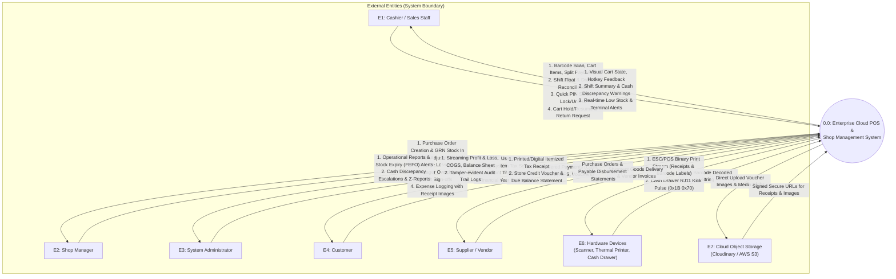
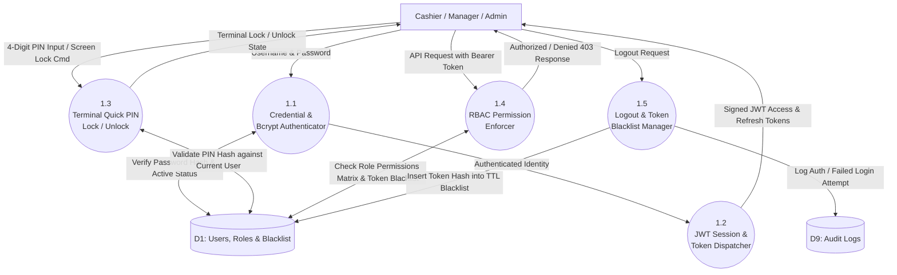
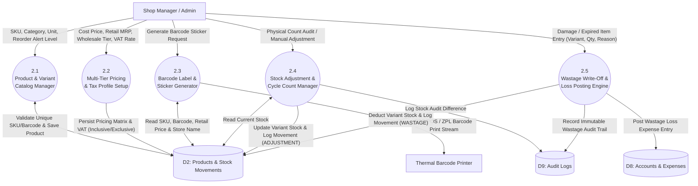
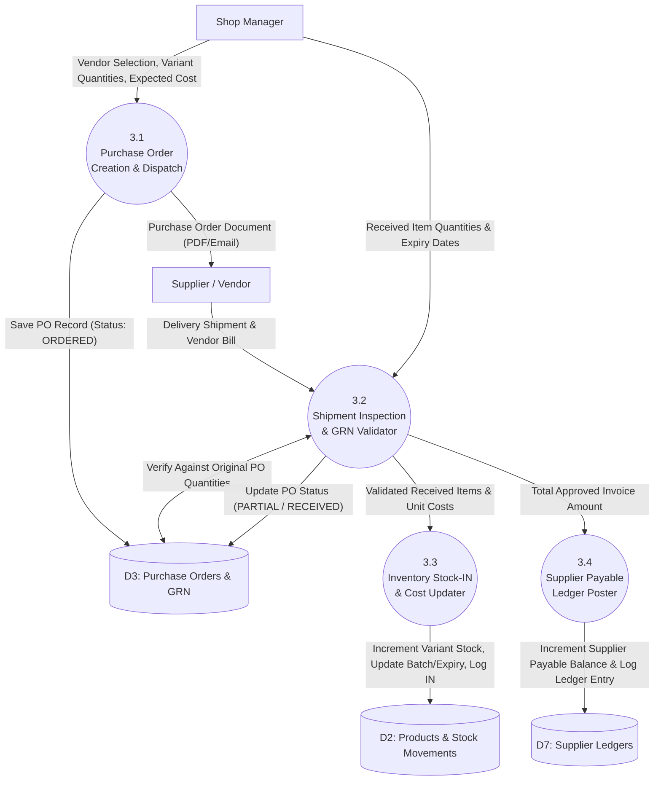
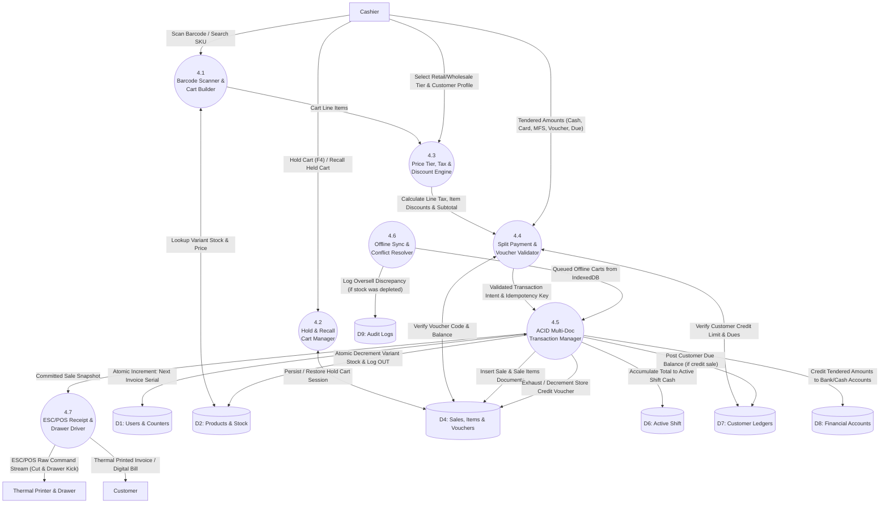
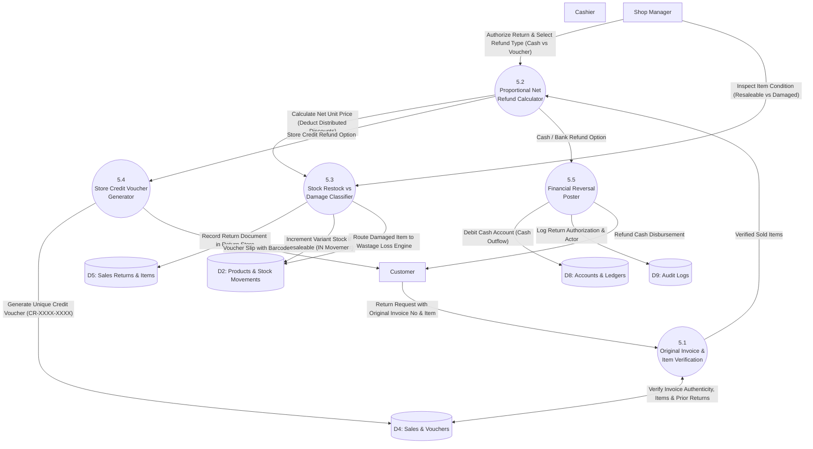
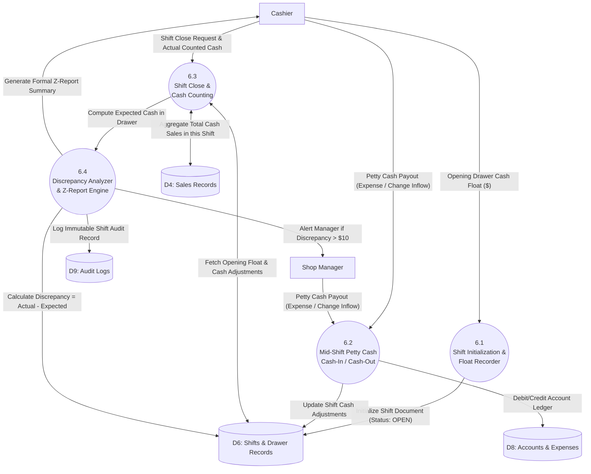
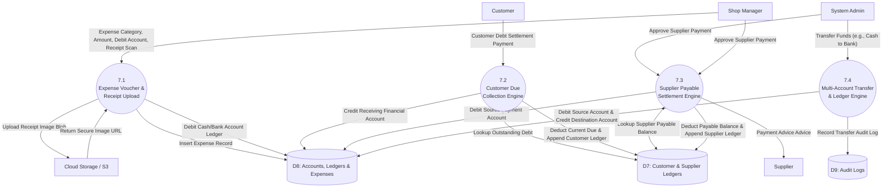
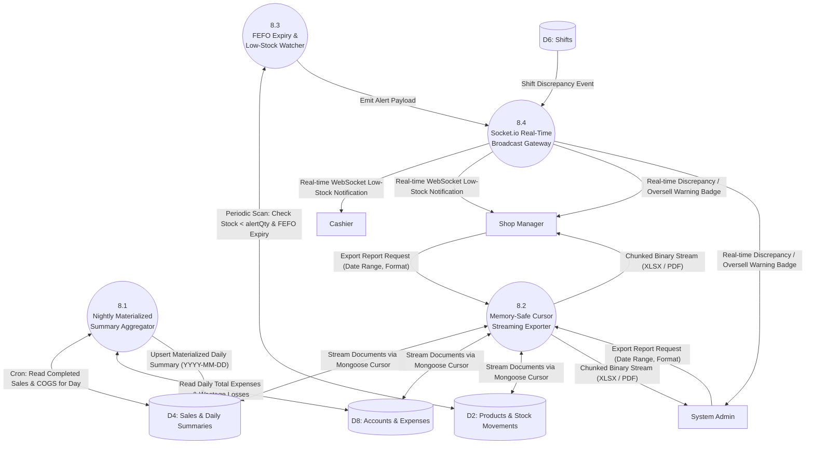

# Data Flow Diagram (DFD) & System Flow Specification
## Enterprise Cloud-Based Point of Sale (POS) & Shop Management System

**Target Architecture:** 3-Tier Layered Monolith (Next.js PWA + Express.js REST/WebSocket + MongoDB Atlas Replica Set)  
**Reference Documents:** [`architecture.md`](file:///c:/Users/lenovo/Documents/point%20of%20sale%20webbase/architecture.md), [`PRD.md`](file:///c:/Users/lenovo/Documents/point%20of%20sale%20webbase/PRD.md) & [`requirement validation.md`](file:///c:/Users/lenovo/Documents/point%20of%20sale%20webbase/requirement%20validation.md)  
**Methodology:** Gane & Sarson DFD Notation with Structured Systems Analysis  
**Author:** Lead Systems Architect & Business Analyst  
**Date:** September 7, 2026  

---

## 1. Context Diagram (Level 0 DFD)

The Context Diagram defines the formal boundary of the Cloud POS & Shop Management System, identifying all interactions with human actors, hardware peripherals, and external storage services.

### 1.1 External Entities Specification
- **E1: Cashier / Sales Staff:** Operates the billing terminal, manages cash drawer floats, executes sales, holds carts, and initiates returns.
- **E2: Shop Manager:** Manages inventory, authorizes price overrides/discounts, signs off on shifts and discrepancy reports, writes off wastage, and oversees procurement.
- **E3: System Administrator:** Manages user roles and RBAC permissions, configures system accounts and tax profiles, and reviews immutable audit logs and financial statements.
- **E4: Customer:** Purchases products, pays via cash/card/MFS/store credit, holds loyalty balances, and requests refunds/invoices.
- **E5: Supplier / Vendor:** Receives purchase orders (PO), delivers stock shipments with vendor invoices, and accepts payable settlements.
- **E6: Hardware Devices:** Physical peripherals including Thermal ESC/POS Printers (80mm/58mm), USB/Bluetooth Barcode Scanners, and RJ11 Cash Drawers.
- **E7: Cloud Storage / CDN (External):** Cloudinary / AWS S3 storage for expense voucher receipts, brand logos, and product variant media.

### 1.2 Mermaid Context Diagram


---

## 2. Level 1 Data Flow Diagram (Subsystems Decomposition)

Level 1 decomposes the entire system into 8 primary operational subsystems. It maps all data paths between external entities, business processes, and the 9 centralized MongoDB Atlas data stores.

### 2.1 Mermaid Level 1 DFD

```mermaid
graph TD
    %% External Entities
    E1["E1: Cashier"]
    E2["E2: Manager"]
    E3["E3: Admin"]
    E4["E4: Customer"]
    E5["E5: Supplier"]
    E6["E6: Hardware Peripherals"]
    E7["E7: Cloud Storage / S3"]

    %% Core Subsystems (Processes)
    P1(("1.0\nAuthentication,\nRBAC & PIN Lock"))
    P2(("2.0\nProduct, Pricing &\nInventory Mgmt"))
    P3(("3.0\nProcurement & PO\nStock Receiving"))
    P4(("4.0\nPOS Sales & Multi-Tier\nAtomic Checkout"))
    P5(("5.0\nSales Returns &\nVoucher Engine"))
    P6(("6.0\nShift & Cash Float\nReconciliation"))
    P7(("7.0\nAccounting, Dues &\nExpense Mgmt"))
    P8(("8.0\nAnalytics, Reports &\nReal-Time Alerts"))

    %% Data Stores
    D1[("D1: Users, Roles & Counters")]
    D2[("D2: Products & Stock Movements")]
    D3[("D3: Purchase Orders & GRN")]
    D4[("D4: Sales, Vouchers & Summaries")]
    D5[("D5: Sales Returns & Restock")]
    D6[("D6: Shifts & Cash Float")]
    D7[("D7: Customer & Supplier Ledgers")]
    D8[("D8: Accounts, Ledgers & Expenses")]
    D9[("D9: Immutable Audit Logs")]

    %% Process 1: Auth & PIN
    E1 & E2 & E3 -->|"Credentials, Quick PIN, Session Invalidation"| P1
    P1 <-->|"Verify User, Role Permissions, PIN Hash"| D1
    P1 -->|"JWT Token, Terminal Lock State"| E1 & E2 & E3
    P1 -->|"Log Auth/Lock Events"| D9

    %% Process 2: Product & Inventory
    E2 & E3 -->|"Product SKU, Price Tiers, Wastage, Adjustments"| P2
    P2 <-->|"Catalog Schemas, Variant Barcodes, Stock Levels"| D2
    P2 -->|"Print Barcode Label Streams"| E6
    P2 -->|"Post Automatic Wastage Loss Expense"| P7
    P2 -->|"Log Catalog Modifications"| D9

    %% Process 3: Procurement & Receiving
    E2 -->|"Create PO, Inspect Received Quantities"| P3
    E5 -->|"Vendor Invoices & Delivery Items"| P3
    P3 <-->|"PO Status, Item Quantities & Costs"| D3
    P3 -->|"Increment Stock Levels & Log Movement (IN)"| D2
    P3 -->|"Post Supplier Payable Ledger Entry"| D7
    P3 -->|"PO Purchase Orders"| E5

    %% Process 4: POS Sales & Atomic Checkout
    E1 -->|"Scan Barcodes, Cart Items, Split Tender, Hold/Resume"| P4
    E6 -->|"Raw Barcode Stream"| P4
    P4 <-->|"Lookup Variant, Price Tiers & Stock Availability"| D2
    P4 <-->|"Fetch Next Sequential Invoice No"| D1
    P4 <-->|"Validate Store Credit Voucher"| D4
    P4 <-->|"Check & Update Customer Credit Limits"| D7
    P4 -->|"Commit Sale & Items Document"| D4
    P4 -->|"Atomic Decrement Stock & Log OUT Movement"| D2
    P4 -->|"Credit Cash/Bank/MFS Ledgers"| D8
    P4 -->|"Link Sale Transaction to Shift"| D6
    P4 -->|"ESC/POS Receipt & Cash Drawer Pulse"| E6
    P4 -->|"Itemized Receipt Invoice"| E4

    %% Process 5: Sales Returns & Vouchers
    E2 -->|"Authorize Return & Restock Disposition"| P5
    E4 -->|"Return Items & Original Invoice"| P5
    P5 <-->|"Verify Original Invoice & Return Limits"| D4
    P5 -->|"Store Return Record & Items"| D5
    P5 -->|"Restock Saleable Goods (IN Movement)"| D2
    P5 -->|"Issue Store Credit Voucher"| D4
    P5 -->|"Debit Financial Account (Cash Refund)"| D8
    P5 -->|"Store Credit / Refund Receipt"| E4

    %% Process 6: Shift & Cash Reconciliation
    E1 -->|"Shift Open Float, Cash In/Out, Actual Cash Count"| P6
    E2 -->|"Manager Discrepancy Approval"| P6
    P6 <-->|"Shift Ledger, Expected Cash State"| D6
    P6 <-->|"Aggregate Cash Inflows from Sales"| D4
    P6 <-->|"Aggregate Cash Outflows from Expenses"| D8
    P6 -->|"Z-Report Summary & Discrepancy Alert"| E1 & E2
    P6 -->|"Audit Discrepancies > $10"| D9

    %% Process 7: Accounting & Expenses
    E2 & E3 -->|"Record Expenses, Transfer Funds"| P7
    E4 & E5 -->|"Customer Due Collections, Supplier Payments"| P7
    P7 -->|"Store Physical Voucher Scans"| E7
    P7 <-->|"Double-Entry Account Ledgers"| D8
    P7 <-->|"Customer & Supplier Outstanding Balances"| D7
    P7 -->|"Log Financial Adjustments"| D9

    %% Process 8: Reporting & Real-time Alerts
    P8 <-->|"Nightly Read Materialized Sales, Costs & Taxes"| D4
    P8 <-->|"Read Live Financial & Stock Ledgers"| D2 & D8
    P8 -->|"Push Real-time Alerts (FEFO Expiry, Low Stock, Shift Discrepancy)"| E1 & E2 & E3
    P8 -->|"Stream P&L, Inventory Valuation (PDF/Excel)"| E2 & E3
```


---

## 3. Level 2 Data Flow Diagrams (Detailed Process Decomposition)

Every subsystem from Level 1 is expanded into detailed functional sub-processes, ensuring complete system visibility and architectural consistency.

---

### 3.1 Sub-Process 1.0: Authentication, RBAC & PIN Lock Decomposition
Deconstructs credentials verification, JWT token lifecycle, terminal screen lock, and role permission enforcement.



---

### 3.2 Sub-Process 2.0: Product, Pricing & Inventory Management Decomposition
Covers variant catalogs, multi-tier pricing, barcode label generation, wastage loss handling, and inventory adjustments.



---

### 3.3 Sub-Process 3.0: Procurement & Stock Receiving (GRN) Decomposition
Handles purchase order workflows, goods receipt inspection (GRN), weighted average cost updates, and supplier payables.



---

### 3.4 Sub-Process 4.0: POS Sales & Atomic Checkout Decomposition
Detailed architecture of the billing counter, cart hold/recall, split tender validation, multi-document ACID execution, offline sync, and receipt printing.



---

### 3.5 Sub-Process 5.0: Sales Returns & Store Credit Voucher Engine Decomposition
Covers return validation against original sale, proportional net discount calculation, restock decisions, and store credit voucher issuance.



---

### 3.6 Sub-Process 6.0: Shift Management & Cash Float Reconciliation Decomposition
Covers cashier terminal opening floats, mid-day petty cash payouts, shift close counting, discrepancy calculation, and manager sign-off.



---

### 3.7 Sub-Process 7.0: Accounting, Dues & Expense Management Decomposition
Covers shop operational expenses with receipt voucher uploads, customer credit settlements, supplier bill disbursements, and multi-account transfers.



---

### 3.8 Sub-Process 8.0: Analytics, Reporting & Real-Time Alert Engine Decomposition
Covers nightly materialized aggregate crons, cursor-streaming PDF/Excel generation, and bi-directional WebSocket push alerts.



---

## 4. Comprehensive Data Dictionary (Data Stores, Collections & Schemas)

This Data Dictionary defines every MongoDB Atlas collection, embedded subdocument, field name, data type, and relational constraint across all 9 data stores.

| Data Store | Entity / Collection | Field Name | Data Type | Constraints / Description |
| :--- | :--- | :--- | :--- | :--- |
| **D1** | `counters` | `_id`<br>`seq` | String<br>Number | e.g. `invoice_seq_20260907`<br>Atomic Auto-increment integer |
| **D1** | `roles` | `_id`<br>`name`<br>`permissions`<br>`description` | ObjectId<br>String<br>Array&lt;String&gt;<br>String | Role identifier<br>`SUPER_ADMIN`, `BRANCH_MANAGER`, `CASHIER`<br>List of permissions (e.g., `pos:sale`, `inv:adjust`)<br>Role description |
| **D1** | `users` | `_id`<br>`username`<br>`fullName`<br>`email`<br>`passwordHash`<br>`pinHash`<br>`roleId`<br>`isActive`<br>`createdAt` | ObjectId<br>String<br>String<br>String<br>String<br>String<br>ObjectId<br>Boolean<br>Date | Unique User ID<br>Unique username<br>Cashier full name<br>Unique email address<br>bcrypt salted password hash<br>bcrypt hashed 4-digit PIN for Terminal Lock<br>Ref: `roles._id`<br>Account active status<br>Creation timestamp |
| **D1** | `token_blacklist` | `_id`<br>`tokenHash`<br>`expiresAt`<br>`createdAt` | ObjectId<br>String<br>Date<br>Date | Blacklist identifier<br>SHA-256 hash of invalidated JWT<br>TTL Index: auto-purged after 24 hours<br>Invalidation timestamp |
| **D1** | `settings` | `_id`<br>`shopName`<br>`address`<br>`phone`<br>`defaultTaxRate`<br>`currency`<br>`allowNegativeStock`<br>`isDefault` | ObjectId<br>String<br>String<br>String<br>Number<br>String<br>Boolean<br>Boolean | Global settings ID<br>Shop title<br>Physical shop address<br>Shop phone number<br>Default shop tax/VAT rate %<br>Currency symbol (e.g. `BDT`, `$`)<br>Allow oversell toggle<br>Default config flag |
| **D2** | `categories` | `_id`<br>`name`<br>`code`<br>`parentId`<br>`defaultTaxRate`<br>`description` | ObjectId<br>String<br>String<br>ObjectId<br>Number<br>String | Category ID<br>Display name (e.g., "Dairy & Eggs")<br>Short code<br>Optional self-referencing subcategory parent<br>Default tax rate for category<br>Category description |
| **D2** | `brands` | `_id`<br>`name`<br>`originCountry` | ObjectId<br>String<br>String | Brand identifier<br>Brand / Manufacturer name<br>Country of origin |
| **D2** | `products` | `_id`<br>`name`<br>`categoryId`<br>`brandId`<br>`supplierId`<br>`unit`<br>`taxType`<br>`taxRate`<br>`variants`<br>`createdAt` | ObjectId<br>String<br>ObjectId<br>ObjectId<br>ObjectId<br>String<br>String<br>Number<br>Array&lt;Subdoc&gt;<br>Date | Unique Product ID<br>Product title<br>Ref: `categories._id`<br>Ref: `brands._id`<br>Ref: `suppliers._id` (Default reorder supplier)<br>`Pcs`, `Kg`, `Gram`, `Ltr`, `Ml`, `Box`, `Meter`, `Goj`<br>`INCLUSIVE`, `EXCLUSIVE`, `EXEMPT`<br>VAT Percentage (e.g., 15 for 15% VAT)<br>Embedded variant subdocuments<br>Creation timestamp |
| **D2** | `variants` (Subdoc) | `_id`<br>`sku`<br>`barcode`<br>`attributeName`<br>`costPrice`<br>`retailSellingPrice`<br>`wholesaleSellingPrice`<br>`currentStock`<br>`alertQty`<br>`expiryDate` | ObjectId<br>String<br>String<br>String<br>Number<br>Number<br>Number<br>Number<br>Number<br>Date | Variant ID<br>Unique SKU code (e.g. `SKU-MILK-1L`)<br>Unique Barcode (EAN-13 / UPC)<br>Variant name (e.g., "1 Liter Bottle", "Red - XL")<br>Cost price (hidden from cashier terminal)<br>Retail selling price (MRP)<br>Wholesale tier price (trade clients)<br>Available inventory count<br>Minimum low-stock threshold warning<br>FEFO expiry date |
| **D2** | `stock_movements`| `_id`<br>`productId`<br>`variantId`<br>`type`<br>`quantity`<br>`referenceType`<br>`referenceId`<br>`reason`<br>`userId`<br>`createdAt` | ObjectId<br>ObjectId<br>ObjectId<br>String<br>Number<br>String<br>ObjectId<br>String<br>ObjectId<br>Date | Movement log ID<br>Ref: `products._id`<br>Ref: `variants._id`<br>`IN`, `OUT`, `ADJUSTMENT`, `RETURN`, `WASTAGE`<br>Quantity moved<br>`SALE`, `PO`, `MANUAL`, `RETURN`, `WASTAGE_EXPENSE`<br>Linked record ID<br>Auditor / Manager explanation note<br>Ref: `users._id`<br>Movement timestamp |
| **D3** | `purchase_orders` | `_id`<br>`poNumber`<br>`supplierId`<br>`status`<br>`items`<br>`totalAmount`<br>`expectedDeliveryDate`<br>`createdById` | ObjectId<br>String<br>ObjectId<br>String<br>Array&lt;Subdoc&gt;<br>Number<br>Date<br>ObjectId | Purchase Order ID<br>Unique sequential serial (`PO-XXXXX`)<br>Ref: `suppliers._id`<br>`DRAFT`, `ORDERED`, `PARTIAL`, `RECEIVED`, `CANCELLED`<br>Array of items, costs, and received quantities<br>Total purchase order cost<br>Expected shipment arrival<br>Ref: `users._id` (Manager) |
| **D3** | `po_items` (Subdoc) | `variantId`<br>`orderedQty`<br>`receivedQty`<br>`unitCost`<br>`lineTotal` | ObjectId<br>Number<br>Number<br>Number<br>Number | Ref: `variants._id`<br>Total units ordered<br>Total units verified during GRN<br>Agreed unit purchase price<br>`orderedQty * unitCost` |
| **D4** | `sales` | `_id`<br>`invoiceNo`<br>`shiftId`<br>`customerId`<br>`cashierId`<br>`items`<br>`pricingTier`<br>`subtotal`<br>`totalTax`<br>`discountAmount`<br>`totalAmount`<br>`paidAmount`<br>`dueAmount`<br>`payments`<br>`idempotencyKey`<br>`createdAt` | ObjectId<br>String<br>ObjectId<br>ObjectId<br>ObjectId<br>Array&lt;Subdoc&gt;<br>String<br>Number<br>Number<br>Number<br>Number<br>Number<br>Number<br>Array&lt;Subdoc&gt;<br>String<br>Date | Unique Sale Document ID<br>Unique sequential invoice (`INV-YYYYMMDD-XXXXX`)<br>Ref: active `shifts._id`<br>Ref: `customers._id` (Optional/Walk-in)<br>Ref: `users._id`<br>List of sold items with snapshots<br>`RETAIL` or `WHOLESALE`<br>Total before tax and discounts<br>Calculated total VAT<br>Cart-level or line-level discount sum<br>Net final payable total<br>Total amount paid by customer<br>Balance due (added to customer ledger)<br>Array of split payment methods<br>Client UUID to prevent double-charging<br>Transaction timestamp |
| **D4** | `sale_items` (Subdoc) | `variantId`<br>`productName`<br>`sku`<br>`quantity`<br>`unitCostPrice`<br>`unitSellingPrice`<br>`taxRate`<br>`taxAmount`<br>`discount`<br>`lineTotal` | ObjectId<br>String<br>String<br>Number<br>Number<br>Number<br>Number<br>Number<br>Number<br>Number | Ref: `variants._id`<br>Snapshot of product name at sale time<br>Snapshot of SKU code<br>Number of units purchased<br>Snapshot of cost price (for exact COGS)<br>Snapshot of selling price<br>Snapshot of tax percentage<br>Calculated tax on line<br>Line item discount<br>Net line total |
| **D4** | `store_credit_vouchers` | `_id`<br>`voucherCode`<br>`customerId`<br>`saleReturnId`<br>`initialBalance`<br>`currentBalance`<br>`status`<br>`expiresAt`<br>`createdAt` | ObjectId<br>String<br>ObjectId<br>ObjectId<br>Number<br>Number<br>String<br>Date<br>Date | Voucher ID<br>Unique `CR-XXXX-XXXX` format<br>Beneficiary Customer ID<br>Ref: `sales_returns._id`<br>Starting credit value<br>Remaining balance available for redemption<br>`ACTIVE`, `EXHAUSTED`, `EXPIRED`<br>Voucher expiration date (e.g. 1 year)<br>Creation timestamp |
| **D4** | `hold_carts` | `_id`<br>`cartId`<br>`userId`<br>`customerId`<br>`pricingTier`<br>`items`<br>`notes`<br>`expiresAt`<br>`createdAt` | ObjectId<br>String<br>ObjectId<br>ObjectId<br>String<br>Array&lt;Subdoc&gt;<br>String<br>Date<br>Date | Hold Cart ID<br>Client cart identifier<br>Ref: `users._id` (Cashier)<br>Ref: `customers._id` (Optional)<br>`RETAIL` or `WHOLESALE`<br>Cart items snapshot<br>Cashier note<br>24h TTL auto-expiry index<br>Creation timestamp |
| **D4** | `daily_sales_summaries` | `_id`<br>`date`<br>`totalSalesRevenue`<br>`totalCOGS`<br>`totalExpenses`<br>`totalWastageLoss`<br>`netProfit`<br>`totalInvoices`<br>`updatedAt` | ObjectId<br>String<br>Number<br>Number<br>Number<br>Number<br>Number<br>Number<br>Date | Summary ID<br>`YYYY-MM-DD` (Unique Index)<br>Aggregated sales turnover<br>Total cost of goods sold<br>Total operational expenses<br>Total written-off wastage cost<br>Net calculated profit<br>Count of completed sales<br>Last aggregation update |
| **D5** | `sales_returns` | `_id`<br>`saleId`<br>`returnNo`<br>`refundAmount`<br>`refundType`<br>`items`<br>`authorizedById`<br>`createdAt` | ObjectId<br>ObjectId<br>String<br>Number<br>String<br>Array&lt;Subdoc&gt;<br>ObjectId<br>Date | Return ID<br>Ref: `sales._id`<br>Unique Return Serial (`RET-YYYYMMDD-XXXXX`)<br>Calculated proportional refund<br>`CASH`, `STORE_CREDIT`<br>Array of returned variant subdocuments<br>Ref: `users._id` (Manager)<br>Return timestamp |
| **D5** | `return_items` (Subdoc) | `variantId`<br>`quantity`<br>`unitRefundPrice`<br>`isResaleable`<br>`restocked` | ObjectId<br>Number<br>Number<br>Boolean<br>Boolean | Ref: `variants._id`<br>Quantity returned<br>Proportional net refund price<br>`true` if clean stock, `false` if damaged<br>`true` if returned to variant inventory |
| **D6** | `shifts` | `_id`<br>`userId`<br>`openedAt`<br>`closedAt`<br>`openingFloat`<br>`cashSalesTotal`<br>`cashExpensesTotal`<br>`pettyCashIn`<br>`pettyCashOut`<br>`expectedCash`<br>`actualCash`<br>`discrepancy`<br>`managerApproval`<br>`status` | ObjectId<br>ObjectId<br>Date<br>Date<br>Number<br>Number<br>Number<br>Number<br>Number<br>Number<br>Number<br>Number<br>ObjectId<br>String | Shift ID<br>Cashier User ID<br>Shift start timestamp<br>Shift close timestamp<br>Starting physical float in drawer<br>Cash collected via POS checkouts<br>Cash spent via drawer payouts<br>Mid-day cash additions<br>Mid-day petty cash drops<br>Calculated drawer cash balance<br>Actual counted cash reported by cashier<br>`actualCash - expectedCash`<br>Ref: `users._id` (if discrepancy approved)<br>`OPEN`, `CLOSED` |
| **D7** | `customers` | `_id`<br>`name`<br>`phone`<br>`email`<br>`creditLimit`<br>`currentDueBalance`<br>`loyaltyPoints`<br>`createdAt` | ObjectId<br>String<br>String<br>String<br>Number<br>Number<br>Number<br>Date | Customer ID<br>Customer name<br>Unique phone number<br>Email address<br>Maximum allowed debt credit limit<br>Current outstanding debt<br>Accumulated loyalty reward points<br>Creation timestamp |
| **D7** | `customer_ledgers` | `_id`<br>`customerId`<br>`transactionType`<br>`amount`<br>`balanceAfter`<br>`referenceId`<br>`createdAt` | ObjectId<br>ObjectId<br>String<br>Number<br>Number<br>ObjectId<br>Date | Ledger entry ID<br>Ref: `customers._id`<br>`SALE_DUE`, `PAYMENT_COLLECTION`, `RETURN_CREDIT`<br>Transaction sum<br>Customer due balance following transaction<br>Ref: `sales._id` or receipt ID<br>Timestamp |
| **D7** | `suppliers` | `_id`<br>`companyName`<br>`contactPerson`<br>`phone`<br>`email`<br>`currentPayableBalance` | ObjectId<br>String<br>String<br>String<br>String<br>Number | Supplier ID<br>Vendor company name<br>Representative name<br>Unique telephone<br>Email address<br>Total balance owed to vendor |
| **D7** | `supplier_ledgers` | `_id`<br>`supplierId`<br>`transactionType`<br>`amount`<br>`balanceAfter`<br>`referenceId`<br>`createdAt` | ObjectId<br>ObjectId<br>String<br>Number<br>Number<br>ObjectId<br>Date | Supplier ledger ID<br>Ref: `suppliers._id`<br>`PO_GRN_BILL`, `PAYMENT_DISBURSAL`<br>Transaction value<br>Balance owed following transaction<br>Ref: `purchase_orders._id`<br>Timestamp |
| **D8** | `expense_categories` | `_id`<br>`name`<br>`code` | ObjectId<br>String<br>String | Category ID<br>e.g., "Shop Rent", "Electricity", "Staff Lunch"<br>Category classification code |
| **D8** | `accounts` | `_id`<br>`name`<br>`accountType`<br>`accountNumber`<br>`currentBalance` | ObjectId<br>String<br>String<br>String<br>Number | Account ID<br>e.g., "Main Cash Drawer", "bKash Merchant", "City Bank"<br>`CASH`, `BANK`, `MFS`<br>Bank / MFS account identifier<br>Current audited balance |
| **D8** | `account_transactions` | `_id`<br>`accountId`<br>`type`<br>`amount`<br>`balanceAfter`<br>`referenceType`<br>`referenceId`<br>`description`<br>`createdAt` | ObjectId<br>ObjectId<br>String<br>Number<br>Number<br>String<br>ObjectId<br>String<br>Date | Transaction ID<br>Ref: `accounts._id`<br>`CREDIT`, `DEBIT`<br>Transaction sum<br>Account balance after transaction<br>`SALE`, `EXPENSE`, `TRANSFER`, `DUE_COLLECTION`, `WASTAGE_LOSS`<br>Linked record ID<br>Accounting entry narration<br>Timestamp |
| **D8** | `expenses` | `_id`<br>`categoryId`<br>`amount`<br>`accountId`<br>`receiptVoucherUrl`<br>`description`<br>`createdById`<br>`createdAt` | ObjectId<br>ObjectId<br>Number<br>ObjectId<br>String<br>String<br>ObjectId<br>Date | Expense record ID<br>Ref: `expense_categories._id`<br>Expense amount<br>Ref: `accounts._id` (Debited)<br>Cloudinary / S3 secure receipt image URL<br>Expense justification<br>Ref: `users._id`<br>Expense date |
| **D9** | `audit_logs` | `_id`<br>`userId`<br>`action`<br>`entity`<br>`entityId`<br>`metadata`<br>`ipAddress`<br>`createdAt` | ObjectId<br>ObjectId<br>String<br>String<br>String<br>Object<br>String<br>Date | Log ID (Immutable)<br>Ref: `users._id` (Actor)<br>`CREATE`, `UPDATE`, `DELETE`, `PRICE_OVERRIDE`, `OFFLINE_OVERSELL`<br>Affected collection name<br>Target document primary key<br>JSON snapshot of state diff / changes<br>Client IP address<br>Timestamp (Indexed) |

---

## 5. Master Data Flow Table

This table details every major data flow within the system, tracing sources, destinations, protocols, and payloads.

| Flow ID | Flow Name | Source | Destination | Protocol / Data Payload | Operational Purpose |
| :--- | :--- | :--- | :--- | :--- | :--- |
| **DF01** | User Auth Request | Cashier / Manager / Admin | Process 1.1 | HTTPS POST `{ username, password }` | User login & JWT issuance |
| **DF02** | Terminal Lock / Unlock | Cashier | Process 1.3 | HTTPS POST `{ pin, shiftId }` | Fast screen lock during cashier breaks |
| **DF03** | Product Catalog Config | Manager / Admin | Process 2.1 | HTTPS POST/PUT `{ name, sku, barcode, prices, tax }` | Catalog CRUD and pricing setup |
| **DF04** | Barcode Sticker Print | Manager / Staff | Process 2.3 $\rightarrow$ E6 | Raw ESC/POS / ZPL stream over TCP/USB | Physical product barcode labeling |
| **DF05** | Wastage Write-Off | Manager | Process 2.5 | HTTPS POST `{ variantId, qty, reason }` | Log damaged stock & post loss expense |
| **DF06** | PO Creation | Manager | Process 3.1 $\rightarrow$ E5 | HTTPS POST / PDF Stream `{ supplierId, items }` | Dispatch stock purchase order |
| **DF07** | GRN Goods Receiving | Manager / Supplier | Process 3.2 | HTTPS POST `{ poId, receivedItems, invoiceNo }` | Stock Inward verification & supplier liability |
| **DF08** | Barcode Scanner Input | Scanner Device (E6) | Process 4.1 | USB HID / Virtual COM raw ASCII scan string | Instant SKU barcode lookup in POS UI |
| **DF09** | Cart Hold / Resume | Cashier | Process 4.2 | LocalStorage / IndexedDB `{ cartId, items }` | Park current cart to serve next customer |
| **DF10** | Manager Price Override | Manager | Process 4.3 | HTTPS POST `{ managerPin, itemId, newPrice }` | Apply discretionary discount on cart item |
| **DF11** | Split Payment Payload | Cashier | Process 4.4 | HTTPS POST `{ items, payments, customerId, idempotencyKey }` | Initiate atomic multi-doc checkout |
| **DF12** | Sequence Increment | Process 4.5 | Data Store D1 | Atomic Mongo `$inc: { seq: 1 }` | Ensure strictly monotonic invoice numbers |
| **DF13** | Offline Cart Sync | Client PWA (IndexedDB) | Process 4.6 | HTTPS POST `/api/v1/pos/sync-offline-queue` | Push buffered sales when internet restores |
| **DF14** | ESC/POS Print & Kick | Process 4.7 | Thermal Device (E6) | Binary Stream: `0x1B 0x70` (Kick) + Formatted Text | Customer tax invoice & cash drawer kick |
| **DF15** | Sales Return Request | Customer / Cashier | Process 5.1 | HTTPS POST `{ invoiceNo, returnedItems, reason }` | Initiate partial/full return of sold items |
| **DF16** | Store Credit Voucher | Process 5.4 | Customer / D4 | Voucher Document `{ voucherCode, balance }` | Issue store credit instead of cash refund |
| **DF17** | Shift Opening Float | Cashier | Process 6.1 | HTTPS POST `{ openingFloat, terminalId }` | Initialize cashier shift and drawer baseline |
| **DF18** | Mid-Shift Petty Cash | Cashier / Manager | Process 6.2 | HTTPS POST `{ amount, type, note }` | Record cash in/out payouts during active shift |
| **DF19** | Shift Close & Z-Report | Cashier / Manager | Process 6.3 | HTTPS POST `{ actualCashCount, note }` | Shift reconciliation, Z-Report & discrepancy |
| **DF20** | Expense Recording | Manager | Process 7.1 | Multipart FormData `{ categoryId, amount, accountId, file }` | Record operational expense & voucher upload |
| **DF21** | Media Upload Stream | Process 7.1 | Cloud Storage (E7) | Binary HTTPS POST (Cloudinary/S3 SDK) | Offload receipt images to cloud bucket |
| **DF22** | Customer Due Collection | Customer / Cashier | Process 7.2 | HTTPS POST `{ customerId, amount, accountId }` | Collect outstanding debt from credit buyer |
| **DF23** | Supplier Due Settlement | Manager / Admin | Process 7.3 | HTTPS POST `{ supplierId, amount, accountId }` | Settle pending vendor invoices |
| **DF24** | Account Funds Transfer | Admin | Process 7.4 | HTTPS POST `{ fromAccountId, toAccountId, amount }` | Move cash from drawer to bank/MFS |
| **DF25** | Nightly Summary Cron | Node-Cron Worker | Process 8.1 | Scheduled Internal Trigger (00:05 AM Daily) | Materialize daily turnover, COGS & profit |
| **DF26** | Memory-Safe Export | Admin / Manager | Process 8.2 | HTTPS GET Stream (Chunked HTTP Transfer) | Export large Excel/PDF ledgers without OOM |
| **DF27** | FEFO Expiry Alert | Inventory Worker | Process 8.3 $\rightarrow$ 8.4 | WebSocket Broadcast `{ variantId, expiryDate, daysLeft }` | Push imminent expiry notifications |
| **DF28** | Real-Time UI Events | Process 8.4 | Cashier / Manager UI | Socket.io WebSocket Connection | Low-stock badges & shift discrepancy alerts |
| **DF29** | Settings Management | Admin | Process 1.4 $\rightarrow$ D1 | HTTPS PUT `/api/v1/settings` | Modify global shop rules & printer configs |
| **DF30** | Hold Cart Sync | Cashier | Process 4.2 $\rightarrow$ D4 | HTTPS POST `/api/v1/pos/hold-cart` | Persist held cart to backend with 24h TTL |

---

## 6. Process Specification & Business Rules

Detailed transformation rules and business logic governing all system operations:

### P1.0: Authentication, RBAC & PIN Terminal Lock
- **Inputs:** DF01, DF02
- **Outputs:** JWT Access Token (15m), Refresh Token (7d), Terminal Lock Status, DF28
- **Transformation Logic:**
  1. Compares hashed passwords using bcrypt with a salt factor of 12.
  2. Enforces brute-force rate limit: max 5 failed attempts per 1 minute per IP.
  3. Cashier Quick PIN lock suspends POS terminal UI without invalidating the active shift or destroying current cart state.
  4. Role-based access control (RBAC) verifies if the user's role contains permission flags before every API controller action.

### P2.0: Product, Pricing & Inventory Management
- **Inputs:** DF03, DF04, DF05
- **Outputs:** Catalog state in D2, Barcode streams to E6, Wastage Expense in D8
- **Transformation Logic:**
  1. Ensures SKU and Barcode uniqueness across the entire system.
  2. Supports dual pricing: `retailSellingPrice` (MRP for regular walk-in customers) and `wholesaleSellingPrice` (discounted tier for bulk trade accounts).
  3. Wastage deductions atomically reduce variant stock, write an immutable `stock_movements` record of type `WASTAGE`, and automatically trigger an accounting expense of category "Wastage Loss" equal to `quantity * costPrice`.

### P3.0: Procurement & PO Receiving (GRN)
- **Inputs:** DF06, DF07
- **Outputs:** PO state in D3, Stock Increment in D2, Supplier Payable in D7
- **Transformation Logic:**
  1. PO moves through states: `DRAFT` $\rightarrow$ `ORDERED` $\rightarrow$ `PARTIAL` $\rightarrow$ `RECEIVED`.
  2. Goods Received Note (GRN) updates received item quantities. When items are received:
     - Atomically increments variant `currentStock`.
     - Logs `stock_movements` of type `IN` with reference to the PO.
     - Adds invoice value to `suppliers.currentPayableBalance` and records entry in `supplier_ledgers`.

### P4.0: POS Sales & Multi-Tier Atomic Checkout
- **Inputs:** DF08, DF09, DF10, DF11, DF13
- **Outputs:** DF12, DF14, Sale Doc in D4, Stock OUT in D2, Account Credit in D8
- **Transformation Logic (MongoDB ACID Session):**
  1. Validates client `idempotencyKey` to guarantee zero duplicate charges.
  2. Executes MongoDB Multi-Document ACID Transaction across collections:
     - Invokes Sequence Generator to fetch `INV-YYYYMMDD-XXXXX`.
     - Decrements variant stock (`currentStock = currentStock - soldQty`).
     - Inserts sale document into `sales` and snapshots line items into `sale_items`.
     - If payment involves store credit voucher, validates code and decrements balance.
     - If credit sale, validates `currentDueBalance + newDue <= creditLimit` and logs customer ledger.
     - Credits financial accounts (Cash drawer, Bank, or MFS) in `account_transactions`.
     - Links sale reference to active shift in `shifts`.
  3. Transmits ESC/POS byte sequence to printer and sends cash drawer kick pulse (`0x1B 0x70`).

### P5.0: Sales Returns & Store Credit Voucher Engine
- **Inputs:** DF15
- **Outputs:** Return Doc in D5, DF16, Account Debit in D8, Stock In in D2
- **Transformation Logic:**
  1. Inspects original sale invoice: verifies that returned quantity $\le$ original sold quantity minus previous returns.
  2. Calculates proportional net refund price: line discounts and cart-level discounts are proportionately factored out.
  3. If item is marked resaleable, stock is atomically incremented and logged as `RETURN`. If damaged, stock is sent to wastage.
  4. If refund method is `STORE_CREDIT`, generates a cryptographic alphanumeric voucher code (`CR-XXXX-XXXX`) saved to `store_credit_vouchers`.

### P6.0: Shift Management & Cash Float Reconciliation
- **Inputs:** DF17, DF18, DF19
- **Outputs:** Z-Report Summary, Shift Doc in D6, Discrepancy Escalation in DF28
- **Transformation Logic:**
  1. Cashier opens shift with `openingFloat`.
  2. Tracks all mid-shift petty cash inflows (`pettyCashIn`) and outflows (`pettyCashOut`).
  3. At shift end, Cashier enters `actualCash` (blind count).
  4. System computes: `expectedCash = openingFloat + cashSalesTotal + pettyCashIn - cashExpensesTotal - pettyCashOut`.
  5. Computes discrepancy: `discrepancy = actualCash - expectedCash`.
  6. If $|discrepancy| > \$10$, an automated escalation event is emitted via Socket.io to the Shop Manager, requiring digital manager PIN sign-off.

### P7.0: Accounting, Dues & Expense Management
- **Inputs:** DF20, DF22, DF23, DF24
- **Outputs:** DF21, Double-Entry Transactions in D8, Ledger Updates in D7
- **Transformation Logic:**
  1. Strict double-entry integrity: every debit to an account requires a corresponding credit or ledger offset.
  2. Expense vouchers upload physical receipts to Cloud Storage (S3/Cloudinary) and attach signed URLs to expense records.
  3. Customer due collections reduce `customers.currentDueBalance` and credit the receiving cash/bank account.
  4. Supplier settlements deduct `suppliers.currentPayableBalance` and debit the disbursement account.

### P8.0: Analytics, Reporting & Real-Time Alert Engine
- **Inputs:** DF25, Historical Records in D2, D4, D6, D8
- **Outputs:** DF26, DF27, DF28, Materialized Summaries in D4
- **Transformation Logic:**
  1. Nightly cron (00:05 AM) aggregates turnover, COGS, expenses, wastage loss, and net profit into `daily_sales_summaries`.
  2. Report export engine queries data using Mongoose streaming cursors to write XLSX/PDF chunks directly to the HTTP response stream, ensuring heap memory stays under 100MB even for 100,000+ records.
  3. Real-time engine periodically checks variants where `currentStock <= alertQty` and flags items approaching expiry (FEFO), broadcasting notifications via authenticated Socket.io rooms.

---

## 7. Data Store Architecture & Storage Policy

| Store ID | Logical Store Name | Storage Technology | Collections Included | Primary Key & Core Indexes | Retention & High Availability |
| :--- | :--- | :--- | :--- | :--- | :--- |
| **D1** | Users, Roles & Counters | MongoDB Atlas Replica Set | `users`, `roles`, `counters`, `token_blacklist` | `_id`, Unique `username`, Unique `counters._id`, TTL on `token_blacklist.expiresAt` | Permanent; Automated Daily Cloud Snapshots |
| **D2** | Products & Stock Movements | MongoDB Atlas Replica Set | `products`, `categories`, `brands`, `stock_movements` | `_id`, Unique `variants.sku`, Unique `variants.barcode`, Index on `stock_movements.variantId` | Permanent; Continuous Point-In-Time Restore (PITR) |
| **D3** | Procurement & GRN | MongoDB Atlas Replica Set | `purchase_orders` | `_id`, Unique `poNumber`, Index on `supplierId`, `status` | Permanent Financial Retention (7 Years) |
| **D4** | Sales, Vouchers & Summaries | MongoDB Atlas Replica Set | `sales`, `store_credit_vouchers`, `daily_sales_summaries` | `_id`, Unique `invoiceNo`, Unique `voucherCode`, Unique `date` (YYYY-MM-DD) | Permanent Financial Retention; Sharded on `createdAt` if volume exceeds 5M rows |
| **D5** | Sales Returns | MongoDB Atlas Replica Set | `sales_returns` | `_id`, Unique `returnNo`, Index on `saleId` | Permanent Financial Retention (7 Years) |
| **D6** | Shifts & Cash Records | MongoDB Atlas Replica Set | `shifts` | `_id`, Index on `userId`, `openedAt`, `status` | Permanent Auditing Retention |
| **D7** | CRM & Vendor Ledgers | MongoDB Atlas Replica Set | `customers`, `customer_ledgers`, `suppliers`, `supplier_ledgers` | `_id`, Unique `customers.phone`, Index on `customer_ledgers.customerId` | Permanent CRM Retention |
| **D8** | Financial Accounts & Ledgers | MongoDB Atlas Replica Set | `accounts`, `account_transactions`, `expenses`, `expense_categories` | `_id`, Index on `account_transactions.accountId`, `createdAt` | Permanent Double-Entry General Ledger |
| **D9** | Immutable Audit Trail | MongoDB Atlas Replica Set | `audit_logs` | `_id`, Compound Index `{ createdAt: -1, entity: 1 }` | Append-Only; Restricted write permissions; Zero update/delete operations |
| **D10** | Cloud Media & Storage | AWS S3 / Cloudinary CDN | Expense Vouchers, Product Images, Logos | Object Key (UUID / Hash), HTTPS CDN distribution | 99.999999999% Durability SLA; Public Read via Signed URL |

---

## 8. Complete Draw.io XML Diagram (Vector Specification)

This XML representation provides an editable diagram compatible with [Draw.io (diagrams.net)](https://app.diagrams.net). To open, go to **File $\rightarrow$ Import $\rightarrow$ XML** or **Extras $\rightarrow$ Edit Diagram**:

```xml
<mxfile host="app.diagrams.net" modified="2026-09-07T18:30:00.000Z" agent="Antigravity Architect" version="21.0.0" type="device">
  <diagram id="Cloud_POS_DFD" name="Cloud POS Data Flow Architecture Level 1">
    <mxGraphModel dx="1600" dy="1000" grid="1" gridSize="10" guides="1" tooltips="1" connect="1" arrows="1" fold="1" page="1" pageScale="1" pageWidth="1654" pageHeight="1169" background="#f8fafc">
      <root>
        <mxCell id="0"/>
        <mxCell id="1" parent="0"/>

        <!-- External Entities (Blue Fill) -->
        <mxCell id="E1" value="E1: Cashier / Sales Staff" style="rounded=1;whiteSpace=wrap;html=1;fillColor=#dbeafe;strokeColor=#2563eb;strokeWidth=2;fontStyle=1;fontSize=13;fontColor=#1e3a8a;" vertex="1" parent="1">
          <mxGeometry x="40" y="260" width="180" height="70" as="geometry"/>
        </mxCell>
        
        <mxCell id="E2" value="E2: Shop Manager" style="rounded=1;whiteSpace=wrap;html=1;fillColor=#dbeafe;strokeColor=#2563eb;strokeWidth=2;fontStyle=1;fontSize=13;fontColor=#1e3a8a;" vertex="1" parent="1">
          <mxGeometry x="40" y="80" width="180" height="70" as="geometry"/>
        </mxCell>

        <mxCell id="E3" value="E3: System Administrator" style="rounded=1;whiteSpace=wrap;html=1;fillColor=#dbeafe;strokeColor=#2563eb;strokeWidth=2;fontStyle=1;fontSize=13;fontColor=#1e3a8a;" vertex="1" parent="1">
          <mxGeometry x="40" y="760" width="180" height="70" as="geometry"/>
        </mxCell>

        <mxCell id="E4" value="E4: Customer" style="rounded=1;whiteSpace=wrap;html=1;fillColor=#dbeafe;strokeColor=#2563eb;strokeWidth=2;fontStyle=1;fontSize=13;fontColor=#1e3a8a;" vertex="1" parent="1">
          <mxGeometry x="1420" y="260" width="180" height="70" as="geometry"/>
        </mxCell>

        <mxCell id="E5" value="E5: Supplier / Vendor" style="rounded=1;whiteSpace=wrap;html=1;fillColor=#dbeafe;strokeColor=#2563eb;strokeWidth=2;fontStyle=1;fontSize=13;fontColor=#1e3a8a;" vertex="1" parent="1">
          <mxGeometry x="1420" y="80" width="180" height="70" as="geometry"/>
        </mxCell>

        <mxCell id="E6" value="E6: Hardware Peripherals&#xa;(Thermal Printer, Drawer, Scanner)" style="rounded=1;whiteSpace=wrap;html=1;fillColor=#dbeafe;strokeColor=#2563eb;strokeWidth=2;fontStyle=1;fontSize=13;fontColor=#1e3a8a;" vertex="1" parent="1">
          <mxGeometry x="1420" y="440" width="180" height="70" as="geometry"/>
        </mxCell>

        <mxCell id="E7" value="E7: Cloud Object Storage&#xa;(Cloudinary / AWS S3)" style="rounded=1;whiteSpace=wrap;html=1;fillColor=#dbeafe;strokeColor=#2563eb;strokeWidth=2;fontStyle=1;fontSize=13;fontColor=#1e3a8a;" vertex="1" parent="1">
          <mxGeometry x="1420" y="760" width="180" height="70" as="geometry"/>
        </mxCell>

        <!-- Core Processes (Green Ellipse) -->
        <mxCell id="P1" value="1.0&#xa;Auth, RBAC &amp;&#xa;PIN Lock" style="ellipse;whiteSpace=wrap;html=1;fillColor=#dcfce7;strokeColor=#16a34a;strokeWidth=2;fontStyle=1;fontSize=12;fontColor=#14532d;" vertex="1" parent="1">
          <mxGeometry x="340" y="60" width="130" height="90" as="geometry"/>
        </mxCell>

        <mxCell id="P2" value="2.0&#xa;Product, Pricing &amp;&#xa;Inventory Mgmt" style="ellipse;whiteSpace=wrap;html=1;fillColor=#dcfce7;strokeColor=#16a34a;strokeWidth=2;fontStyle=1;fontSize=12;fontColor=#14532d;" vertex="1" parent="1">
          <mxGeometry x="580" y="60" width="140" height="90" as="geometry"/>
        </mxCell>

        <mxCell id="P3" value="3.0&#xa;Procurement &amp;&#xa;PO Receiving" style="ellipse;whiteSpace=wrap;html=1;fillColor=#dcfce7;strokeColor=#16a34a;strokeWidth=2;fontStyle=1;fontSize=12;fontColor=#14532d;" vertex="1" parent="1">
          <mxGeometry x="840" y="60" width="140" height="90" as="geometry"/>
        </mxCell>

        <mxCell id="P4" value="4.0&#xa;POS Sales &amp;&#xa;Atomic Checkout" style="ellipse;whiteSpace=wrap;html=1;fillColor=#dcfce7;strokeColor=#16a34a;strokeWidth=3;fontStyle=1;fontSize=13;fontColor=#14532d;" vertex="1" parent="1">
          <mxGeometry x="580" y="250" width="150" height="100" as="geometry"/>
        </mxCell>

        <mxCell id="P5" value="5.0&#xa;Sales Returns &amp;&#xa;Vouchers" style="ellipse;whiteSpace=wrap;html=1;fillColor=#dcfce7;strokeColor=#16a34a;strokeWidth=2;fontStyle=1;fontSize=12;fontColor=#14532d;" vertex="1" parent="1">
          <mxGeometry x="840" y="255" width="140" height="90" as="geometry"/>
        </mxCell>

        <mxCell id="P6" value="6.0&#xa;Shift &amp; Cash Float&#xa;Reconciliation" style="ellipse;whiteSpace=wrap;html=1;fillColor=#dcfce7;strokeColor=#16a34a;strokeWidth=2;fontStyle=1;fontSize=12;fontColor=#14532d;" vertex="1" parent="1">
          <mxGeometry x="340" y="255" width="140" height="90" as="geometry"/>
        </mxCell>

        <mxCell id="P7" value="7.0&#xa;Accounting, Dues&#xa;&amp; Expenses" style="ellipse;whiteSpace=wrap;html=1;fillColor=#dcfce7;strokeColor=#16a34a;strokeWidth=2;fontStyle=1;fontSize=12;fontColor=#14532d;" vertex="1" parent="1">
          <mxGeometry x="460" y="580" width="150" height="90" as="geometry"/>
        </mxCell>

        <mxCell id="P8" value="8.0&#xa;Analytics, Reports&#xa;&amp; Alerts Engine" style="ellipse;whiteSpace=wrap;html=1;fillColor=#dcfce7;strokeColor=#16a34a;strokeWidth=2;fontStyle=1;fontSize=12;fontColor=#14532d;" vertex="1" parent="1">
          <mxGeometry x="720" y="580" width="150" height="90" as="geometry"/>
        </mxCell>

        <!-- Data Stores (Yellow Open Rectangles) -->
        <mxCell id="D1" value="D1: Users, Roles &amp; Counters" style="shape=partialRectangle;whiteSpace=wrap;html=1;left=0;right=0;fillColor=#fef08a;strokeColor=#ca8a04;strokeWidth=2;fontStyle=1;fontSize=12;fontColor=#713f12;" vertex="1" parent="1">
          <mxGeometry x="320" y="190" width="180" height="35" as="geometry"/>
        </mxCell>

        <mxCell id="D2" value="D2: Products &amp; Stock Movements" style="shape=partialRectangle;whiteSpace=wrap;html=1;left=0;right=0;fillColor=#fef08a;strokeColor=#ca8a04;strokeWidth=2;fontStyle=1;fontSize=12;fontColor=#713f12;" vertex="1" parent="1">
          <mxGeometry x="560" y="190" width="190" height="35" as="geometry"/>
        </mxCell>

        <mxCell id="D3" value="D3: Purchase Orders &amp; GRN" style="shape=partialRectangle;whiteSpace=wrap;html=1;left=0;right=0;fillColor=#fef08a;strokeColor=#ca8a04;strokeWidth=2;fontStyle=1;fontSize=12;fontColor=#713f12;" vertex="1" parent="1">
          <mxGeometry x="820" y="190" width="180" height="35" as="geometry"/>
        </mxCell>

        <mxCell id="D4" value="D4: Sales, Vouchers &amp; Summaries" style="shape=partialRectangle;whiteSpace=wrap;html=1;left=0;right=0;fillColor=#fef08a;strokeColor=#ca8a04;strokeWidth=2;fontStyle=1;fontSize=12;fontColor=#713f12;" vertex="1" parent="1">
          <mxGeometry x="560" y="400" width="190" height="35" as="geometry"/>
        </mxCell>

        <mxCell id="D5" value="D5: Sales Returns &amp; Items" style="shape=partialRectangle;whiteSpace=wrap;html=1;left=0;right=0;fillColor=#fef08a;strokeColor=#ca8a04;strokeWidth=2;fontStyle=1;fontSize=12;fontColor=#713f12;" vertex="1" parent="1">
          <mxGeometry x="820" y="400" width="180" height="35" as="geometry"/>
        </mxCell>

        <mxCell id="D6" value="D6: Shifts &amp; Cash Float" style="shape=partialRectangle;whiteSpace=wrap;html=1;left=0;right=0;fillColor=#fef08a;strokeColor=#ca8a04;strokeWidth=2;fontStyle=1;fontSize=12;fontColor=#713f12;" vertex="1" parent="1">
          <mxGeometry x="320" y="400" width="180" height="35" as="geometry"/>
        </mxCell>

        <mxCell id="D7" value="D7: Customer &amp; Supplier Ledgers" style="shape=partialRectangle;whiteSpace=wrap;html=1;left=0;right=0;fillColor=#fef08a;strokeColor=#ca8a04;strokeWidth=2;fontStyle=1;fontSize=12;fontColor=#713f12;" vertex="1" parent="1">
          <mxGeometry x="320" y="500" width="190" height="35" as="geometry"/>
        </mxCell>

        <mxCell id="D8" value="D8: Accounts, Ledgers &amp; Expenses" style="shape=partialRectangle;whiteSpace=wrap;html=1;left=0;right=0;fillColor=#fef08a;strokeColor=#ca8a04;strokeWidth=2;fontStyle=1;fontSize=12;fontColor=#713f12;" vertex="1" parent="1">
          <mxGeometry x="560" y="500" width="200" height="35" as="geometry"/>
        </mxCell>

        <mxCell id="D9" value="D9: Immutable Audit Logs" style="shape=partialRectangle;whiteSpace=wrap;html=1;left=0;right=0;fillColor=#fef08a;strokeColor=#ca8a04;strokeWidth=2;fontStyle=1;fontSize=12;fontColor=#713f12;" vertex="1" parent="1">
          <mxGeometry x="820" y="500" width="180" height="35" as="geometry"/>
        </mxCell>

        <!-- Connecting Flows -->
        <mxCell id="flow1" value="Barcode / Checkout Payload" style="edgeStyle=orthogonalEdgeStyle;rounded=0;html=1;entryX=0;entryY=0.5;entryDx=0;entryDy=0;strokeColor=#475569;strokeWidth=1.5;" edge="1" source="E1" target="P4" parent="1">
          <mxGeometry relative="1" as="geometry"/>
        </mxCell>

        <mxCell id="flow2" value="Invoice / Receipt" style="edgeStyle=orthogonalEdgeStyle;rounded=0;html=1;exitX=1;exitY=0.5;exitDx=0;exitDy=0;entryX=0;entryY=0.5;entryDx=0;entryDy=0;strokeColor=#475569;strokeWidth=1.5;" edge="1" source="P4" target="E4" parent="1">
          <mxGeometry relative="1" as="geometry"/>
        </mxCell>

        <mxCell id="flow3" value="ESC/POS Stream &amp; Drawer Kick" style="edgeStyle=orthogonalEdgeStyle;rounded=0;html=1;exitX=1;exitY=0.8;exitDx=0;exitDy=0;entryX=0;entryY=0.5;entryDx=0;entryDy=0;strokeColor=#475569;strokeWidth=1.5;" edge="1" source="P4" target="E6" parent="1">
          <mxGeometry relative="1" as="geometry"/>
        </mxCell>

        <mxCell id="flow4" value="Receipt Image Upload" style="edgeStyle=orthogonalEdgeStyle;rounded=0;html=1;exitX=1;exitY=0.5;exitDx=0;exitDy=0;entryX=0;entryY=0.5;entryDx=0;entryDy=0;strokeColor=#475569;strokeWidth=1.5;" edge="1" source="P7" target="E7" parent="1">
          <mxGeometry relative="1" as="geometry"/>
        </mxCell>

        <mxCell id="flow5" value="PO Dispatch" style="edgeStyle=orthogonalEdgeStyle;rounded=0;html=1;exitX=1;exitY=0.5;exitDx=0;exitDy=0;entryX=0;entryY=0.5;entryDx=0;entryDy=0;strokeColor=#475569;strokeWidth=1.5;" edge="1" source="P3" target="E5" parent="1">
          <mxGeometry relative="1" as="geometry"/>
        </mxCell>

        <mxCell id="flow6" value="Inventory &amp; Wastage" style="edgeStyle=orthogonalEdgeStyle;rounded=0;html=1;entryX=0;entryY=0.5;entryDx=0;entryDy=0;strokeColor=#475569;strokeWidth=1.5;" edge="1" source="E2" target="P2" parent="1">
          <mxGeometry relative="1" as="geometry"/>
        </mxCell>

        <mxCell id="flow7" value="Admin Config &amp; Ledger Audit" style="edgeStyle=orthogonalEdgeStyle;rounded=0;html=1;entryX=0;entryY=0.5;entryDx=0;entryDy=0;strokeColor=#475569;strokeWidth=1.5;" edge="1" source="E3" target="P7" parent="1">
          <mxGeometry relative="1" as="geometry"/>
        </mxCell>

      </root>
    </mxGraphModel>
  </diagram>
</mxfile>
```

---

## 9. DFD Architectural Validation Report & Balancing Matrix

This section demonstrates strict adherence to Gane & Sarson DFD validation laws, Parent-Child balancing principles, and the ACID transactional requirements established in the [`PRD.md`](file:///c:/Users/lenovo/Documents/point%20of%20sale%20webbase/PRD.md) and [`architecture.md`](file:///c:/Users/lenovo/Documents/point%20of%20sale%20webbase/architecture.md).

### 9.1 Gane & Sarson Rule Compliance Matrix

| Rule # | Architectural Invariant | Audit Status | Evidence & Verification Reference |
| :--- | :--- | :---: | :--- |
| **Rule 1** | **No Black Hole Processes**<br>Every process must produce at least one output data flow. | ✅ PASS | Verified: Processes P1.0 through P8.0, as well as all sub-processes (P1.1–P8.4), generate verified output data flows. |
| **Rule 2** | **No Miracle Processes**<br>Every process must consume at least one input data flow. | ✅ PASS | Verified: No process generates data spontaneously; all output payloads are derived directly from input arguments or data store queries. |
| **Rule 3** | **No Miracle Data Stores**<br>Data stores cannot spontaneously originate data without write operations. | ✅ PASS | Verified: All stores D1 through D9 have explicitly mapped write processes (e.g., D1 written by P1.0 & P4.5; D2 by P2.0, P3.3, P4.5, P5.3; D4 by P4.5, P5.4, P8.1). |
| **Rule 4** | **Entity $\leftrightarrow$ Store Isolation**<br>External entities can never directly read or write to data stores. | ✅ PASS | Verified: 100% of entity interactions pass through the Express.js API Gateway / Controller / Service processes before reaching MongoDB repositories. |
| **Rule 5** | **Entity $\leftrightarrow$ Entity Isolation**<br>External entities cannot transfer data directly between each other inside the system boundary. | ✅ PASS | Verified: All communication (e.g., Cashier $\rightarrow$ Customer receipt, Manager $\rightarrow$ Supplier PO) is intermediated by system processes. |
| **Rule 6** | **Parent-Child Balancing**<br>Inputs and outputs of Level 1 processes must match aggregated inputs/outputs of Level 2 sub-processes. | ✅ PASS | Verified: All Level 1 processes (1.0 through 8.0) match the external inputs and data store links of their decomposed Level 2 diagrams (Section 3). |

### 9.2 Critical Enterprise Invariants Verification

1. **Atomic Multi-Document POS Transaction (Process 4.5):**
   - **Requirement:** Stock decrement, invoice number generation, sale insertion, shift cash accumulation, and account crediting must succeed or fail as an atomic unit.
   - **DFD Implementation:** Sub-process 4.5 acts as the single coordinator holding an active MongoDB Client Session (`mongoose.startSession()`). It binds D1 (`counters`), D2 (`variants`), D4 (`sales`), D6 (`shifts`), D7 (`customers`), and D8 (`accounts`). If any sub-operation fails, the session aborts with complete rollback.

2. **Sequential Invoicing Without Collisions (DF12 & Sub-process 4.5):**
   - **Requirement:** Cashiers operating simultaneous lanes must never receive duplicate invoice serial numbers.
   - **DFD Implementation:** Coordinated by Sub-process 4.5 via atomic MongoDB `$inc` on `counters` key `invoice_seq_YYYYMMDD`, ensuring strictly monotonic ordering.

3. **Offline Sync & Conflict Resolution (DF13 & Sub-process 4.6):**
   - **Requirement:** Transactions recorded in IndexedDB during network failure must synchronize safely upon reconnect.
   - **DFD Implementation:** Sub-process 4.6 validates client idempotency keys, re-runs atomic checkout in Sub-process 4.5, and flags any oversell discrepancy directly into `audit_logs` (D9) while raising a real-time badge event in Sub-process 8.4.

4. **Blind Cash Drop & Shift Reconciliation (Process 6.0):**
   - **Requirement:** Cashier must count actual cash without prior knowledge of system expectation, and discrepancies over $10 require manager sign-off.
   - **DFD Implementation:** Sub-process 6.3 accepts blind `actualCash`, compares it against calculated ledger totals from D4, D6, and D8, and automatically locks the shift while routing discrepancies $> \$10$ to Manager E2 and Audit Store D9.

5. **Memory-Safe Analytics Streaming (DF26 & Sub-process 8.2):**
   - **Requirement:** Large Excel/PDF financial ledger exports must not exhaust Node.js heap memory.
   - **DFD Implementation:** Sub-process 8.2 streams documents row-by-row using Mongoose cursor pipelines (`.cursor()`) piped directly to Express response streams without buffering full datasets in RAM.

---
*This document defines the complete Data Flow Diagram (DFD), Data Dictionary, and Flow Specifications for the Cloud-Based Point of Sale & Shop Management System.*
