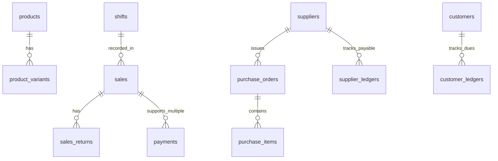

# Senior Business Analyst & Systems Analyst PRD Review Report
**Project:** Cloud-Based Point of Sale (POS) & Shop Management System  
**Reviewed File:** [`PRD.md`](file:///c:/Users/lenovo/Documents/point%20of%20sale%20webbase/PRD.md)  
**Reviewer:** Senior Business Analyst & Systems Analyst  
**Date:** September 7, 2026  

---

## 1. Executive Summary / ওভারভিউ
`PRD.md` ডকুমেন্টটি একটি Modern Web-based POS System-এর জন্য খুব সুন্দর এবং সুশৃঙ্খলভাবে তৈরি করা হয়েছে। এতে টেকনোলজি স্ট্যাক, ইউজার রোল (RBAC), পেজ স্ট্রাকচার, ERD, বিজনেস লজিক এবং সিকিউরিটির ভালো একটি বেসলাইন রয়েছে। 

তবে, একজন **Senior Business Analyst** হিসেবে বাস্তব জীবনের রিটেইল শপ অপারেশন (Retail Shop Operations) এবং কমার্শিয়াল POS সিস্টেমের সাথে তুলনা করলে এই PRD-তে বেশ কিছু গুরুত্বপূর্ণ **Functional Requirements (FR)**, **Non-Functional Requirements (NFR)** এবং **Database Schema Gaps** খুঁজে পাওয়া গেছে। এগুলো সমাধান না করলে ডেভেলপমেন্টের মাঝে বড় ধরনের আর্কিটেকচারাল রিফ্যাক্টরিং করতে হবে।

---

## 2. Missing Functional Requirements (ফাংশনাল রিকোয়ারমেন্টের ঘাটতি)

### A. Point of Sale (POS) & Checkout Operations
1. **Hold & Resume Cart (Draft Sales / Park Sale):**
   - **সমস্যা:** কাস্টমার কাউন্টারে বিল করার সময় কোনো প্রোডাক্ট আনতে ভুলে গেলে বা ক্যাশিয়ারের সময় লাগলে কার্ট "Hold" বা "Park" করার সুবিধা নেই। 
   - **রিকোয়ারমেন্ট:** ক্যাশিয়ার চলমান কার্ট হোল্ড করে পরের কাস্টমারের সেল কমপ্লিট করতে পারবে এবং পরবর্তীতে হোল্ড করা কার্ট রিস্টোর করতে পারবে।
2. **Multi-Payment / Split Payment (স্প্লিট পেমেন্ট):**
   - **সমস্যা:** বর্তমান ERD ও PRD ধরে নিচ্ছে ১টি সেলে ১টি মাত্র পেমেন্ট মেথড থাকবে।
   - **রিকোয়ারমেন্ট:** বাস্তবে কাস্টমার কিছু টাকা ক্যাশ, বাকিটা bKash/Nagad বা কার্ডে দিতে পারে (যেমন: ৫০% Cash + ৫০% Card)। `payments` টেবিলকে এমনভাবে ডিজাইন করতে হবে যাতে ১টি সেলের অধীনে একাধিক পেমেন্ট রেকর্ড থাকতে পারে।
3. **Sales Return, Refund & Exchange (পণ্য ফেরত ও এক্সচেঞ্জ):**
   - **সমস্যা:** PRD-তে সেলের Returns/Cancellations এক লাইনে বলা হয়েছে, কিন্তু বিস্তারিত লজিক নেই।
   - **রিকোয়ারমেন্ট:** 
     - পার্শিয়াল রিটার্ন (১০টি পণ্যের মধ্যে ১টি ফেরত)।
     - ক্যাশ রিফান্ড নাকি স্টোর ক্রেডিট/ভাউচার প্রদান।
     - ড্যামেজড প্রোডাক্ট (ইনভেন্টরিতে ব্যাক হবে না) বনাম সেলঅ্যাবল প্রোডাক্ট (ইনভেন্টরিতে যুক্ত হবে)।
4. **Shift Opening / Closing & Z-Report (ক্যাশ ড্রয়ার রেকনসিলিয়েশন):**
   - **সমস্যা:** শিফট শুরুর ক্যাশ ফ্ল্যাশ (Opening Cash Float) এবং দিন শেষে ক্যাশ রেজিস্টার মেলানোর (Cash Drawer Reconciliation / Daily Z-Report) সুবিধা নেই।
   - **রিকোয়ারমেন্ট:** প্রতিদিন কাজ শুরুর আগে কত টাকা ক্যাশে ছিল, সারাদিনের মোট ক্যাশ সেল, ক্যাশ আউট (Expenses) এবং দিন শেষে ড্রয়ারে প্রকৃত ক্যাশ (Actual Cash vs System Expected Cash) মেলানোর কাউন্টিং ফিচার।

---

### B. Inventory & Procurement Management (ইনভেন্টরি ও ক্রয় ব্যবস্থাপনা)
1. **Purchase Orders (PO) & Supplier Stock Receiving:**
   - **সমস্যা:** PRD-তে স্টোক যুক্ত করার জন্য শুধুমাত্র "Manual stock adjustment" রাখা হয়েছে। সরবরাহকারী (Supplier) থেকে মাল কেনার কোনো Purchase Order (PO) বা Stock GRN (Goods Received Note) প্রসেস নেই।
   - **রিকোয়ারমেন্ট:** Supplier থেকে প্রোডাক্ট কেনার পর Stock IN হওয়া এবং Supplier-এর কাছে বাকি/দেনাপাওনা (Accounts Payable) অটোমেটিক আপডেট হওয়ার ওয়ার্কফ্লো থাকা জরুরি।
2. **Product Variants & Attributes (প্রোডাক্ট ভ্যারিয়েন্ট):**
   - **সমস্যা:** বর্তমানে শুধুমাত্র সিঙ্গেল প্রোডাক্ট ধরা হয়েছে। কিন্তু কাপড়ের দোকান, জুতার দোকান বা ইলেকট্রনিক্সে সাইজ (S, M, L, XL), কালার (Red, Blue) বা ব্র্যান্ড অনুযায়ী ভ্যারিয়েন্ট থাকে।
   - **রিকোয়ারমেন্ট:** Parent Product $\rightarrow$ Product Variants (SKU, Price, Stock per variant) সাপোর্ট থাকা দরকার।
3. **Batch No, Expiry Date & Serial No Tracking:**
   - **সমস্যা:** ফার্মেসি, মুদি দোকান বা ইলেকট্রনিক্সের জন্য ব্যাচ নম্বর, মেয়াদ উত্তীর্ণের তারিখ (Expiry Date) বা মোবাইল/ল্যাপটপের IMEI/Serial Number ট্র্যাকিংয়ের সুযোগ নেই।
   - **রিকোয়ারমেন্ট:** FIFO/FEFO (First Expired, First Out) স্টক ডিডাকশন অপশন।

---

### C. CRM, Customer Credit & Supplier Dues (বাকি অ্যাকাউন্টস)
1. **Customer Credit / Due Sales (বাকির খাতা):**
   - **সমস্যা:** পরিচিত কাস্টমারের কাছে বাকিতে বিক্রি করা এবং পরবর্তীতে বাকির টাকা (Accounts Receivable / Credit Collection) জমার হিসেব PRD-তে নেই।
   - **রিকোয়ারমেন্ট:** Customer Ledger (কত টাকা বাকি আছে, বাকির পেমেন্ট এন্ট্রি, ক্রেডিট লিমিট সেট করা)।
2. **Supplier Accounts Payable (সাপ্লায়ার বাকি):**
   - **সমস্যা:** সাপ্লায়ারকে তাৎক্ষণিক বা আংশিক পেমেন্ট দিয়ে মাল কেনার পর বাকি টাকা ট্র্যাকিংয়ের ফিচার নেই।

---

## 3. Missing Non-Functional Requirements (নন-ফাংশনাল রিকোয়ারমেন্টের ঘাটতি)

### A. Performance & Usability NFRs
1. **POS Hotkeys & Keyboard Navigation (কীবোর্ড শর্টকাট):**
   - POS কাউন্টারে দ্রুত কাজ করার জন্য মাউস ছাড়া কীবোর্ড দিয়ে সব কাজ করার সাপোর্ট থাকতে হবে (যেমন: `F2` = Search, `F9` = Pay, `Esc` = Cancel Cart, `Enter` = Confirm Checkout)।
2. **Barcode Scanning Latency:**
   - বারকোড স্ক্যান করার সাথে সাথে কার্টে প্রোডাক্ট অ্যাড হওয়ার সময় < ১০০ms (Milliseconds) হতে হবে।
3. **Checkout Transaction Performance:**
   - ফাইনাল চেকআউট বাটনে ক্লিক করার পর ডাটাবেজ ট্রানজেকশন কমপ্লিট হয়ে রসিদ প্রিন্ট প্রিভিউ আসতে সময় < ১.৫ সেকেন্ড হতে হবে।

### B. Hardware Integration & Compatibility
1. **Printer Support:**
   - Standard A4/Letter প্রিন্টারের পাশাপাশি **Thermal Receipt Printer (58mm, 80mm ESC/POS)** সরাসরি সাপোর্ট করা।
2. **Cash Drawer Kick:**
   - সেল কমপ্লিট হওয়ার সাথে সাথে থার্মাল প্রিন্টারের মাধ্যমে অটোমেটিক Cash Drawer পপ-আপ/ওপেন করার সাপোর্ট।

### C. Reliability & Offline Resiliency
1. **Offline / Network Interruption Buffer:**
   - ইন্টারনেট কানেকশন স্লো হলে বা সাময়িক বিচ্ছিন্ন হলে যাতে POS স্ক্রীন ফ্রিজ বা ক্র্যাশ না করে। অন্তত LocalStorage/IndexedDB-তে অফলাইন ডাটা বাফেটিং এবং ইন্টারনেট আসলে অটো-সিঙ্ক (Auto-Sync) করার প্রোভিশন থাকা উচিত।

### D. Security & Audit Trail Integrity
1. **Immutable Audit Logs:**
   - সেলস হিস্ট্রি বা অ্যাকাউন্টের ডাটা ডিলিট/এডিট করলে Audit Log তৈরি হবে এবং Audit Log টেবিল থেকে ডাটা ডিলিট করার অধিকার Admin-এরও থাকবে না (Append-Only Log)।
2. **System Timezone & Invoice Serial Numbering:**
   - প্রতি বছরের জন্য বা প্রতি শপের জন্য সিকোয়েনশিয়াল ইনভয়েস নম্বর (e.g., `INV-2026-00001`) যা কখনই ডুপ্লিকেট বা গ্যাপ হবে না।

---

## 4. Proposed Database Schema Modifications (ERD আপডেট)

PRD-র ERD টেবিলগুলোতে নিচের নতুন টেবিলগুলো যোগ করা উচিত:

### নতুন টেবিলসমূহ:
1. `purchase_orders` & `purchase_items`: সাপ্লায়ার থেকে মাল ক্রয়ের রেকর্ড।
2. `product_variants`: সাইজ, কালার ইত্যাদির জন্য।
3. `shifts` / `cash_registers`: শিফট ওপেনিং, ক্লোজিং ও ক্যাশ রেকনসিলিয়েশন।
4. `sales_returns` & `return_items`: কাস্টমার পণ্য ফেরত দিলে হিসেব রাখার জন্য।
5. `customer_ledgers` & `supplier_ledgers`: বাকির হিসেব (Due/Credit Tracking)।

---

## 5. Summary Checklist for Recommended PRD Revisions (ALL COMPLETED)

- [x] **POS:** Hold/Resume Cart (`hold_carts` TTL collection), Split Payments, Thermal Printer 80mm/58mm format, Cash Drawer ESC/POS integration specs added.
- [x] **Inventory:** Purchase Order (PO) & GRN workflow, Product Variants (`variants`), Batch/Expiry tracking (`batches`), `supplierId` added.
- [x] **Finance & Credit:** Customer Due / Credit Sales (`customer_ledgers`) এবং Supplier Payable (`supplier_ledgers`) management added.
- [x] **Shift Management:** Daily Opening Cash Float & Z-Report Closing Audit (`shifts`) added.
- [x] **NFR:** POS Keyboard Hotkeys (`F2`, `F4`, `F8`, `F9`, `Ctrl+L`), Latency Benchmarks (<100ms scan, <1.5s checkout), and Immutable Log enforcement (`audit_logs`) added.

---
*ডকুমেন্টটি প্রজেক্টের রিকোয়ারমেন্ট পূর্ণাঙ্গ করতে সাহায্য করবে।*
